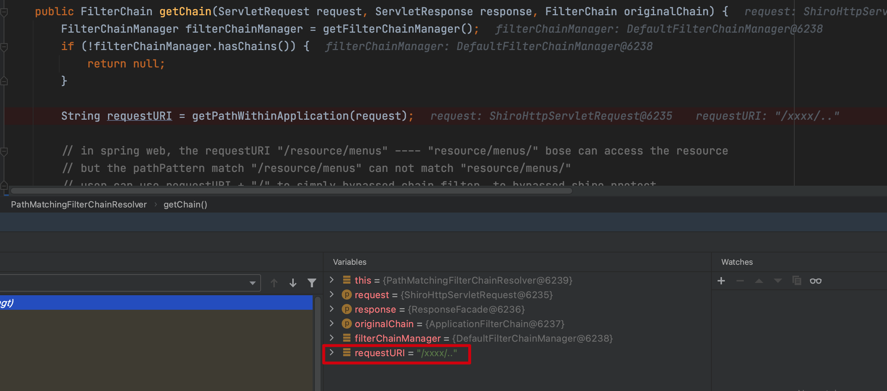
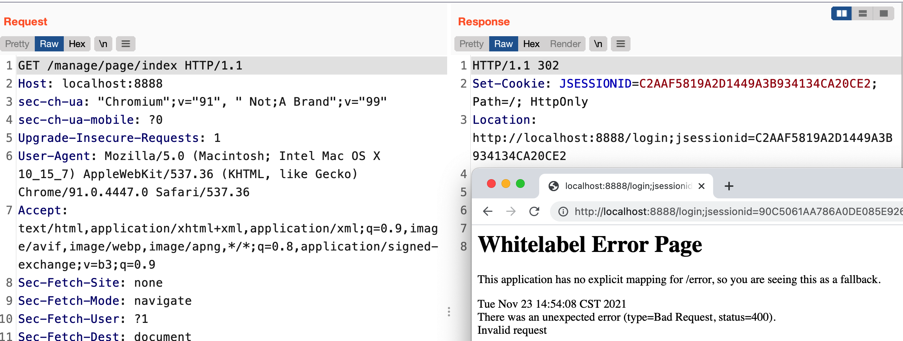
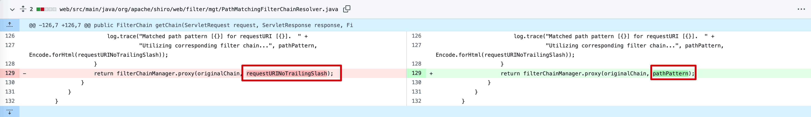

## Shiro权限绕过漏洞汇总

### 前言

Shiro本身是一个常用的Java安全框架，用于执行身份验证、授权、密码和会话管理功能，有着易用、全面、灵活等特性，shiro被广泛使用。通常Shiro会和Spring等框架一起搭配用于Web应用系统的开发。

### Shiro配置简介

Shiro是基于URI的权限认证，配置的url模式使用Ant风格模式。Ant路径通过通配符支持“?”、“*”、“**”。

对于“?”，其匹配一个字符串。如“/admin?”将匹配“admin1”，但不匹配“/admin”或“/admin/”。

对于“*”，其匹配零个或多个字符串。如“/admin/*”将匹配“/admin/”、“/admin/abc”，但不匹配“/admin/a/b”。

对于“\ *\*”，其匹配路径中的零个或多个路径。如“/admin/**”将匹配“/admin/a”或“/admin/a/b”。

常用的拦截器配置：

```
// authc:所有url都必须认证通过才可以访问; 
// anon:所有url都都可以匿名访问
// user指的是用户认证通过或者配置了Remember Me记住用户登录状态后可访问
```

拦截器的匹配顺序采取第一次匹配优先的方式，即从头开始使用第一个匹配的url模式对应的拦截器链。

### SHIRO-682

[[SHIRO-682\] fix the potential threat when use "uri = uri + '/' " to bypassed shiro protect - ASF JIRA (apache.org)](https://issues.apache.org/jira/browse/SHIRO-682)

```
在Spring web中/resource/menus和 resource/menus/都能访问到同一资源。
而shiro中的pathPattern只能匹配/resource/menus，而不能匹配 /resource/menus/。
用户使用requestURI + "/"就能绕过权限控制。
```

该漏洞的修复仅仅对`URI`最后的`/`进行处理，若`URI`最后为`/`则删除


坦白来说，这次改动并非是触及漏洞的核心，漏洞的本质其实是由于**Spring处理URI和Shiro处理URI不一致**导致的。所以后续仍然出现多个绕过漏洞。

### CVE-2020-1957

#### 影响版本

Apache Shiro < 1.5.2

#### 漏洞复现

这里设置路径如下，登录路径为`/login`,登录成功跳转为`/admin/page`


配置路径如下：

```java
        Map<String, String> map = new LinkedHashMap<>();
        map.put("/doLogin", "anon");
        map.put("/admin/*", "authc");
        map.put("/manage/*", "authc");
```

可以看到直接访问`/shiro/admin/page`直接跳转到登录页面


当访问`/shiro/xxxx/..;/admin/page`时，成功进入登录页面


#### 漏洞分析

Shiro中对于URI的获取与匹配在org.apache.shiro.web.filter.mgt.PathMatchingFilterChainResolver#getChain中

```java
    public FilterChain getChain(ServletRequest request, ServletResponse response, FilterChain originalChain) {
        FilterChainManager filterChainManager = getFilterChainManager();
        if (!filterChainManager.hasChains()) {
            return null;
        }

        String requestURI = getPathWithinApplication(request);

        // in spring web, the requestURI "/resource/menus" ---- "resource/menus/" bose can access the resource
        // but the pathPattern match "/resource/menus" can not match "resource/menus/"
        // user can use requestURI + "/" to simply bypassed chain filter, to bypassed shiro protect
        if(requestURI != null && !DEFAULT_PATH_SEPARATOR.equals(requestURI)
                && requestURI.endsWith(DEFAULT_PATH_SEPARATOR)) {
            requestURI = requestURI.substring(0, requestURI.length() - 1);
        }


        //the 'chain names' in this implementation are actually path patterns defined by the user.  We just use them
        //as the chain name for the FilterChainManager's requirements
        for (String pathPattern : filterChainManager.getChainNames()) {
            if (pathPattern != null && !DEFAULT_PATH_SEPARATOR.equals(pathPattern)
                    && pathPattern.endsWith(DEFAULT_PATH_SEPARATOR)) {
                pathPattern = pathPattern.substring(0, pathPattern.length() - 1);
            }

            // If the path does match, then pass on to the subclass implementation for specific checks:
            if (pathMatches(pathPattern, requestURI)) {
                if (log.isTraceEnabled()) {
                    log.trace("Matched path pattern [" + pathPattern + "] for requestURI [" + Encode.forHtml(requestURI) + "].  " +
                            "Utilizing corresponding filter chain...");
                }
                return filterChainManager.proxy(originalChain, pathPattern);
            }
        }

        return null;
    }
```

当我们尝试用payload绕过时，可以看到如下，requestURI最终获得的是我们的`/xxxx/..`，而不是完整路径，那么很明显，漏洞出现在这里，我们跟进`getPathWithinApplication`



最终调用的是org.apache.shiro.web.util.WebUtils#getPathWithinApplication，继续跟进到`getRequestUri`


org.apache.shiro.web.util.WebUtils#getRequestUri，其实看到这里的`request.getRequestURI()`，基本就知道漏洞的成因了


继续跟进到`decodeAndCleanUriString`,org.apache.shiro.web.util.WebUtils#decodeAndCleanUriString


可以发现这里对;后面的内容进行了删除，所以传入的payload `/shiro/xxxx/..;/admin/page`，最后Shiro只获得了`/xxxx/..`,``没有匹配到shiro配置中的规则，默认放行。而Spring对`..;/`是包容的，会被当成`../`处理，所以最后访问的是`/shiro/admin/page`。

#### 漏洞修复

官方修复[commit](https://github.com/apache/shiro/commit/3708d7907016bf2fa12691dff6ff0def1249b8ce#diff-98f7bc5c0391389e56531f8b3754081a)如下，这里直接替换了不安全的`request.getRequestURI()`


可以看到1.5.2版本中获取的就是`/shiro//admin/page`，无法再通过`../`和`;`绕过


### CVE-2020-11989

#### 影响版本

Apache Shiro < 1.5.3

#### 漏洞复现

##### 利用方式一：

测试PayLoad：`/shiro;/admin/page`


##### 利用方式二：

添加Controller

```java
    @RequestMapping("/manage/{name}")
    public String manageName(@PathVariable String name) {
        return "manage: "+name;
    }
```

正常访问：


测试PayLoad：`/shiro/manage/test%252Ftest`


#### 漏洞分析

利用方式一：

还是老地方org.apache.shiro.web.util.WebUtils#getRequestUri


之后代码没有变，还是截取获得`;`之前的内容。最后shiro得到的URI是`/shiro;`，不会匹配到身份认证校验规则，默认放行。

但是这里有一个前提条件是contextpath必须有，如果没有，获取默认为空


利用方式二：

这里问题出在org.apache.shiro.web.util.WebUtils#decodeAndCleanUriString


Shiro二次解码获得的是/shiro/manage/test/test,因为鉴权规则设置的是`/manage/*`一个星号，只匹配一层目录，`/shiro/manage/test/test`，算是两层目录，也就不属于`/manage/*`。而Spring解析时只会将URI解码一次，得到的是`/shiro/manage/test%2ftest`，从而绕过访问。

#### 漏洞修复

官方在1.5.3进行了修复工作，修改了URI的获取逻辑，使用移除分号后的`request.getRequestURI`和`request.getPathInfo()`进行URI拼接。并且没有用`decodeAndCleanUriString()`方法处理URI，避免了二次URL解码。


### CVE-2020-13933

#### 影响版本

Apache Shiro < 1.6.0

#### 漏洞复现

测试PayLoad：/shiro/manage/%3Bindex


#### 漏洞分析

老地方org.apache.shiro.web.filter.mgt.PathMatchingFilterChainResolver#getChain，这里最后获得的路径是`/manage/`


而在Spring中org.springframework.web.util.UrlPathHelper#getLookupPathForRequest(javax.servlet.http.HttpServletRequest)，获取的路径却是`/manage/;index`


从而导致绕过

#### 漏洞修复

官方[commit](https://github.com/apache/shiro/commit/dc194fc977ab6cfbf3c1ecb085e2bac5db14af6d)增加了web/src/main/java/org/apache/shiro/web/filter/InvalidRequestFilter.java文件，对分号`;`、反斜杠`\`、和ascii不可打印字符进行必要处理。


### CVE-2020-17523

#### 影响版本

Apache Shiro < 1.7.1

#### 漏洞复现

##### 利用方式一：

Payload：/shiro/manage/%20


##### 利用方式二：

这种利用方式要开启全路径的场景下`setAlwaysUseFullPath(true)`

```java
@SpringBootApplication
public class ShiroExampleApplication extends SpringBootServletInitializer implements BeanPostProcessor {

    @Override
    protected SpringApplicationBuilder configure(SpringApplicationBuilder builder) {
        return builder.sources(ShiroExampleApplication.class);
    }

    @Override
    public Object postProcessBeforeInitialization(Object bean, String beanName) throws BeansException {
        if (bean instanceof RequestMappingHandlerMapping) {
            ((RequestMappingHandlerMapping) bean).setAlwaysUseFullPath(true);
        }
        return bean;
    }

    @Override
    public Object postProcessAfterInitialization(Object bean, String beanName)
            throws BeansException {
        return bean;
    }


    public static void main(String[] args) {
        SpringApplication.run(ShiroExampleApplication.class, args);
    }

}
```

PayLoad:/shiro/manage/%2e/


#### 漏洞分析

##### 利用方式一：

org.apache.shiro.web.filter.mgt.PathMatchingFilterChainResolver#getChain和Config规则进行匹配，到对应规则后继续跟进


一直跟进，直到org.apache.shiro.util.AntPathMatcher#doMatch，这里就可以看到经过两次`tokenizeToStringArray`,此时的pathDirs已经没有`*`了，即不存在二层路径！，这会导致一个问题，就是`pathMatches（"/manage/*","/manage/xx"）`和`pathMatches（"/manage/*","/manage/ "）`，前者正常匹配，后者匹配失败。


这里跟进一下tokenizeToStringArray，进入org.apache.shiro.util.StringUtils#tokenizeToStringArray(java.lang.String, java.lang.String)，这里trmTokens默认为true，我们继续跟进tokenizeToStringArray


org.apache.shiro.util.StringUtils#tokenizeToStringArray(java.lang.String, java.lang.String, boolean, boolean)，这里经过`trim()`处理，首尾空格被清除。再次返回`getChain`时最后一个`/`被删除。因此`tokenizeToStringArray`返回的pathDirs没有第二层路径。


`/manage`与`/manage/*`匹配失败，导致鉴权绕过。而Spring接受到的访问路径为`/manage/%20`，按照正常逻辑返回响应，因此导致权限被绕过。

##### 利用方式二：

这里重点跟进到org.apache.shiro.web.util.WebUtils#normalize(java.lang.String, boolean)

```java
    private static String normalize(String path, boolean replaceBackSlash) {

        if (path == null)
            return null;

        // Create a place for the normalized path
        String normalized = path;
				
      	// 将 \\ 处理为/
        if (replaceBackSlash && normalized.indexOf('\\') >= 0)
            normalized = normalized.replace('\\', '/');
				
      // 将 /. 处理为 /
        if (normalized.equals("/."))
            return "/";

        // Add a leading "/" if necessary
        if (!normalized.startsWith("/"))
            normalized = "/" + normalized;

        // Resolve occurrences of "//" in the normalized path
        // 将 //处理为 /
        while (true) {
            int index = normalized.indexOf("//");
            if (index < 0)
                break;
            normalized = normalized.substring(0, index) +
                    normalized.substring(index + 1);
        }

        // Resolve occurrences of "/./" in the normalized path
       // 将/./ 处理为 /
        while (true) {
            int index = normalized.indexOf("/./");
            if (index < 0)
                break;
            normalized = normalized.substring(0, index) +
                    normalized.substring(index + 2);
        }

        // Resolve occurrences of "/../" in the normalized path
       // 将/../直接处理掉 即 /xx/../aa --> /aa
        while (true) {
            int index = normalized.indexOf("/../");
            if (index < 0)
                break;
            if (index == 0)
                return (null);  // Trying to go outside our context
            int index2 = normalized.lastIndexOf('/', index - 1);
            normalized = normalized.substring(0, index2) +
                    normalized.substring(index + 3);
        }

        // Return the normalized path that we have completed
        return (normalized);

    }
```

经过normalize处理，我们的`/manage/.`就变成了`/manage/`


之后经过org.apache.shiro.web.filter.mgt.PathMatchingFilterChainResolver#getChain向下处理变成/manage


继续向下，直接匹配失败，此时就已经绕过了Shiro的鉴权


而此时Spring匹配到的是`/manage/.`,如果没有开启全路径匹配的话，在Spring中`.`和`/`是作为路径分隔符的，不参与路径匹配。如果开启，那么返回200。

####  漏洞修复

经过上面的分析得出以下结论

1. `tokenizeToStringArray`函数没有正确处理空格。
2. 处理最后一个`/`的逻辑，不应在循环匹配路径的逻辑之前。

所以官方修复[commit](https://github.com/apache/shiro/commit/0842c27fa72d0da5de0c5723a66d402fe20903df)如下：

1、将`tokenizeToStringArray`参数`trimTokens`置为false


2、调整删除最后一个`/`的逻辑。修改成先匹配原始路径，匹配失败后再去删除最后一个`/`。


### CVE-2021-41303

#### 影响版本

Apache Shiro < 1.8.0

#### 漏洞复现

修改Config配置，设置`/manage/page/index`路径权限为任意用户均可以匿名访问，`/manage/*/index`路径权限为需要进行认证才能访问


设置Controller如下：

```java
@RestController
public class TestController {
    @GetMapping("/manage/page/index")
    public String admin(){
        return "Hello";
    }

    @GetMapping("/manage/{current}/index")
    public String hello(){
        return "false";
    }
}
```

按照逻辑来看，首先匹配的是`/manage/*/index`,那么直接访问`/manage/page/index`应该是匹配第一个路径，即需要身份认证



而此时访问`/manage/page/index/`时就绕过了权限认证


#### 漏洞分析

还是老地方org.apache.shiro.web.filter.mgt.PathMatchingFilterChainResolver#getChain，在`removeTrailingSlash`后，`/manage/page/index/`变成`/manage/page/index`


之后进入`PathMatches`-->`doMatch`，经过`tokenizeToStringArray`将路径拆分为数组


之后经过org.apache.shiro.util.AntPathMatcher#doMatch的强匹配，很明显，第一轮匹配由于存在`/`，所以匹配失败


第二轮去掉了最后的`/`，就匹配成功了


匹配成功后，Shiro这边通过，而Spring获得的路径是


直接就绕过了权限限制

#### 漏洞修复

官方把1.7.1的更改改了回去。。，主要还是因为1.7.1把外部可控的`requestURINoTrailingSlash`带入到了`filterChainManager.proxy()`，导致的匹配问题，而且利用难度是真的比较高




### 参考

[Apache Shiro 两种姿势绕过认证分析（CVE-2020-17523）](https://github.com/jweny/shiro-cve-2020-17523)

[Shiro权限验证绕过史](https://s31k31.github.io/2020/08/20/Shiro_Authentication_Bypass/)

[Apache Shiro | Simple. Java. Security.](https://shiro.apache.org/security-reports.html)

[从源码diff分析Apache-Shiro 1.7.1版本的auth bypass（CVE-2021-41303）） | 大彩笔threedr3am](https://threedr3am.github.io/2021/09/22/从源码diff分析Apache-Shiro 1.7.1版本的auth bypass（CVE-2021-41303）/)